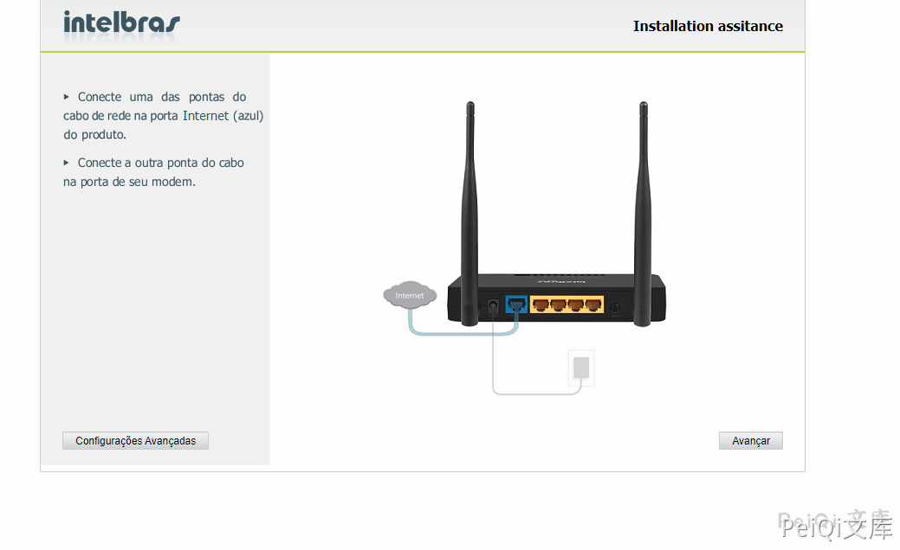
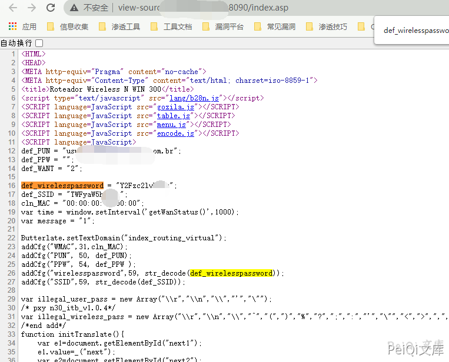
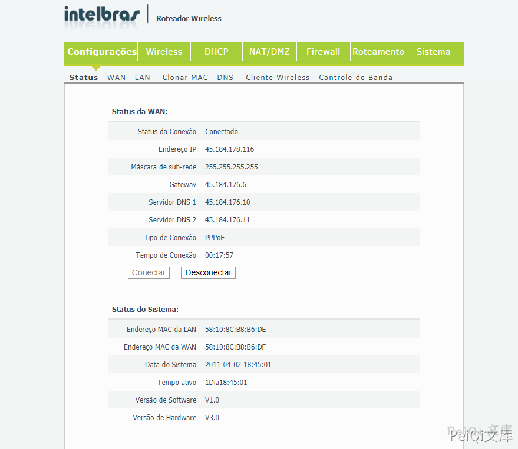

# Intelbras Wireless 未授权与密码泄露 CVE-2021-3017

## 漏洞描述

Intelbras IWR 3000N是波兰Intelbras公司的一款无线路由器。 Intelbras WIN 300 and WRN 342 devices 2021-01-04版本及之前版本存在安全漏洞，该漏洞允许远程攻击者通过读取HTML源代码中的def wireless spassword行来发现凭据。

## 漏洞影响

```
win_300_firmware 等
```

## 网络测绘

```
body="def_wirelesspassword"
```

## 漏洞复现

登录页面如下



查看网页源代码，泄露了配置密码



测试了一下其他的，发现出现账号密码的原因为访问的是路由的配置页面，配置后获取后台权限

