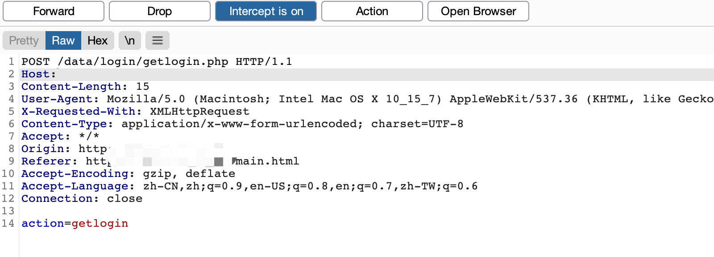
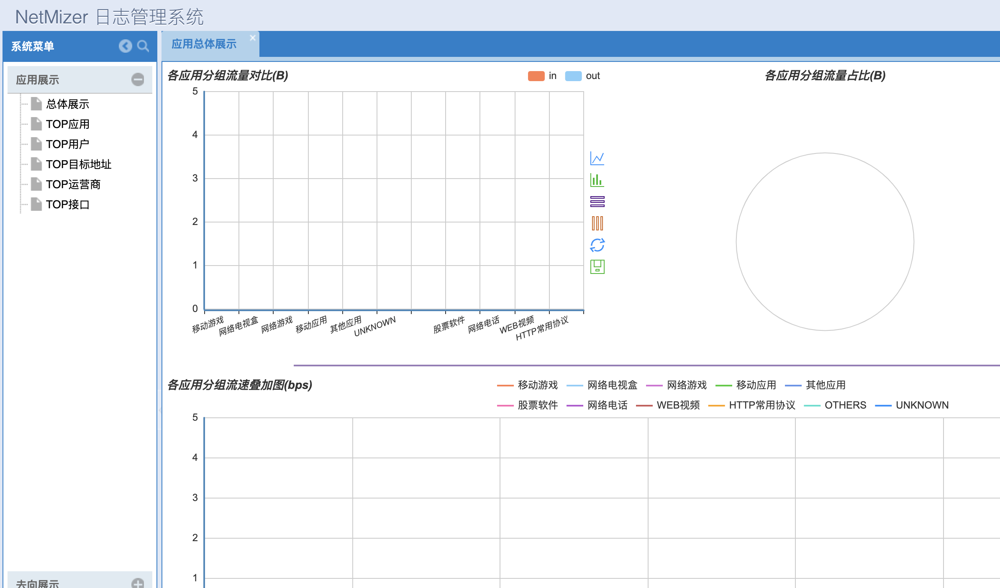

# NetMizer 日志管理系统 登录绕过漏洞

## 漏洞描述

NetMizer 日志管理系统存在登录绕过漏洞，通过限制某个请求包的发送获取后台权限

## 漏洞影响

```
NetMizer 日志管理系统
```

## 网络测绘

```
title="NetMizer 日志管理系统"
```

## 漏洞复现

登录页面


访问页面 main.html 并抓取请求包, 使用Burp Drop掉下面对请求包



Drop后停止抓包，成功进入后台

