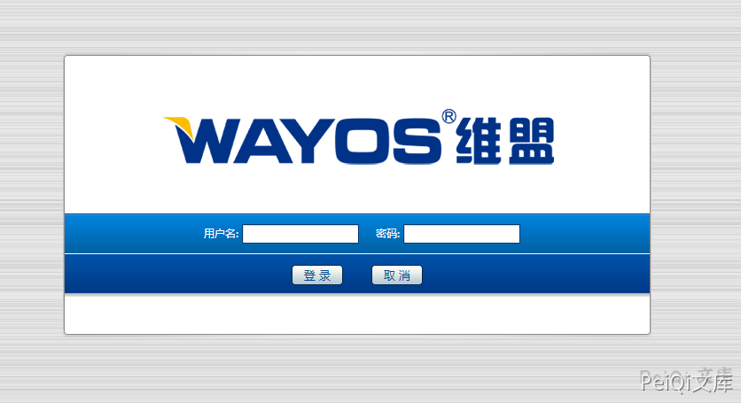
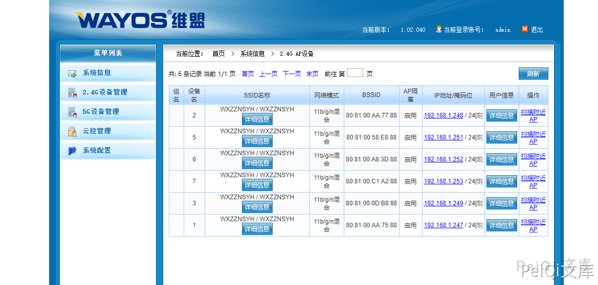

# Wayos AC集中管理系统默认弱口令 CNVD-2021-00876

## 漏洞描述

深圳维盟科技股份有限公司是国内领先的网络设备及智能家居产品解决方案供应商，主营产品包括无线网关、交换机、国外VPN、双频吸顶ap等。

AC集中管理平台存在弱口令漏洞，攻击者可利用该漏洞获取敏感信息。

## 漏洞影响

```
AC集中管理系统
```

## 网络测绘

```
title="AC集中管理系统"
```

## 漏洞复现

默认弱口令为 admin:admin




