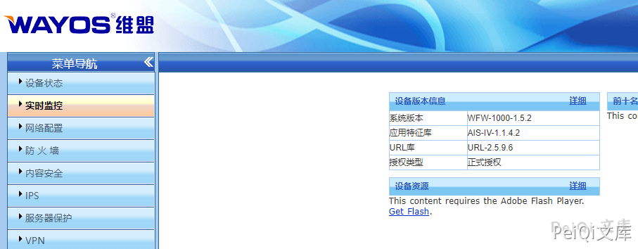

# Wayos 防火墙 账号密码泄露漏洞

## 漏洞描述

Wayos 防火墙存在账号密码泄露漏洞，攻击者通过前端可以查看到密码的md5的加密字符，解密后可以登陆后台

## 漏洞影响

```
Wayos 防火墙
```

## 网络测绘

```
body="Get_Verify_Info(hex_md5(user_string)."
```

## 漏洞复现

登录页面如下

F12 查看账号密码


解密Md5即可登录后台

