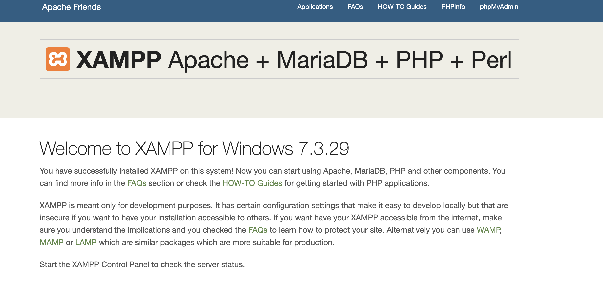
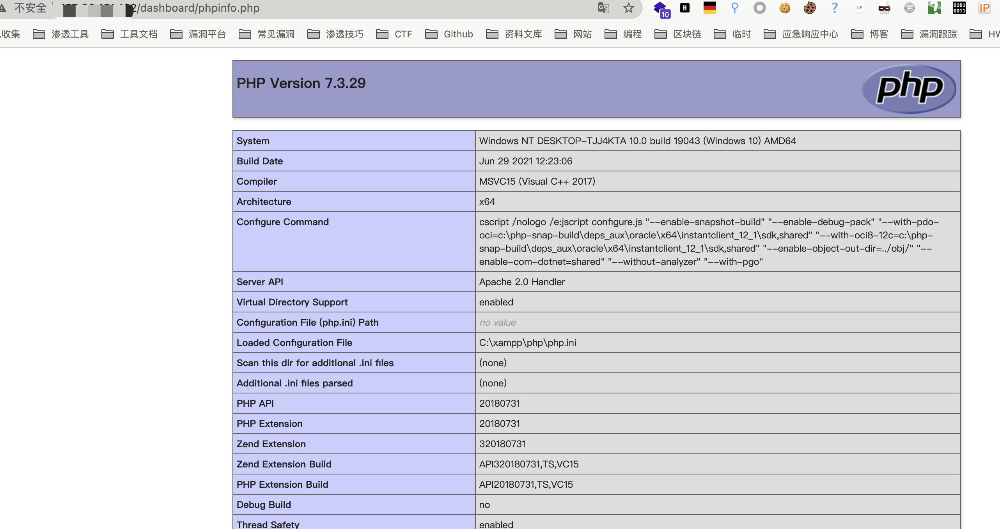

# XAMPP phpinfo.php 信息泄漏漏洞

## 漏洞描述

XAMPP存在信息泄露漏洞，/dashboard/phpinfo.php 访问权限控制不严格，攻击者可获取系统敏感信息。

## 漏洞影响

```
XAMPP
```

## 网络测绘

```
"Welcome to XAMPP"
```

## 漏洞复现

登录页面



访问页面 **/dashboard/phpinfo.php** 

