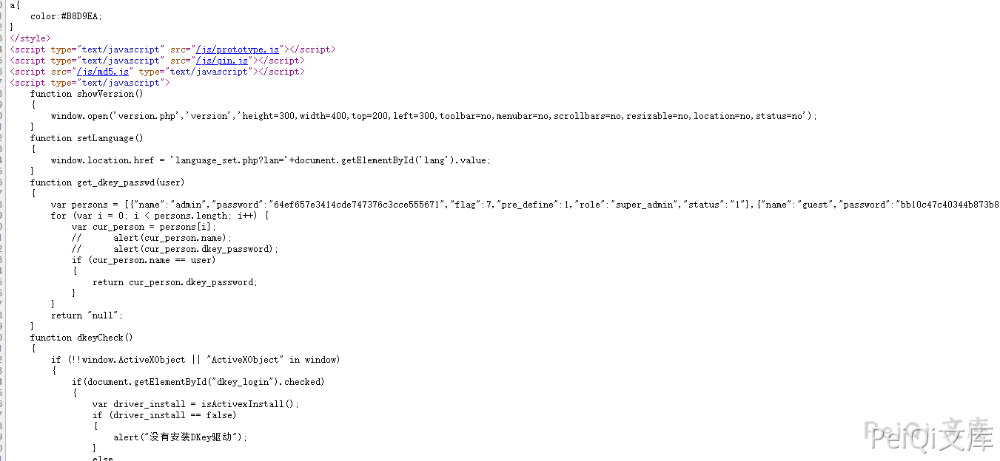
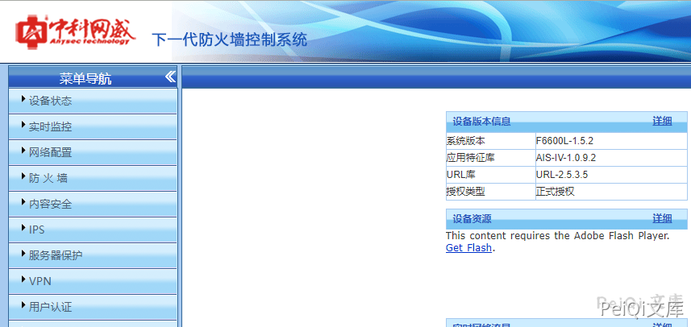

# 中科网威 下一代防火墙控制系统 账号密码泄露漏洞

## 漏洞描述

中科网威 下一代防火墙控制系统 存在账号密码泄露漏洞，攻击者通过前端获取密码的Md5后解密可获取完整密码登陆后台

## 漏洞影响

```
中科网威 下一代防火墙控制系统
```

## 网络测绘

```
body="Get_Verify_Info(hex_md5(user_string)."
```

## 漏洞复现

登录页面如下


F12查看前端发现 admin的md5加密密码



解密后登录后台

