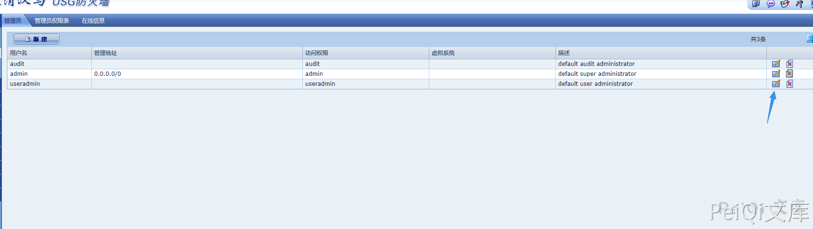
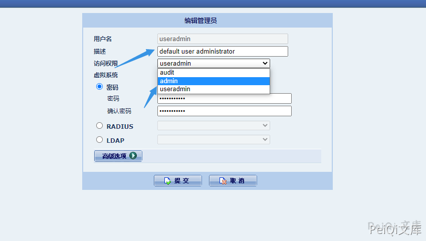

# 启明星辰 天清汉马USG防火墙 逻辑缺陷漏洞 CNVD-2021-12793

## 漏洞描述

启明星辰 天清汉⻢USG防⽕墙 存在逻辑缺陷漏洞，攻击者通过账号密码可以进入后台后更改任意用户权限升级为管理员。

## 漏洞影响

```
启明星辰 天清汉马USG防火墙
```

## 网络测绘

```
title="天清汉马USG防火墙"
```

## 漏洞复现

登录后台后管理界面点击下面的图标



更改权限为任意用户,刷新后得到用户权限

