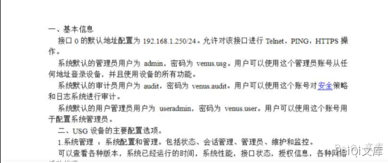
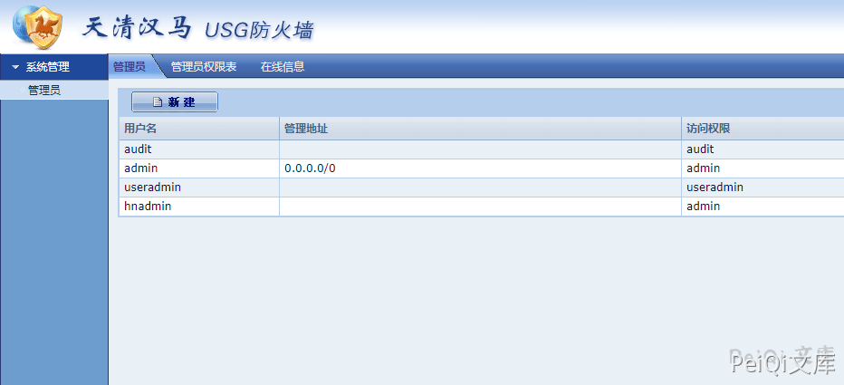

# 启明星辰 天清汉马USG防火墙 默认口令漏洞

## 漏洞描述

启明星辰 天清汉⻢USG防⽕墙 存在默认口令漏洞，攻击者通过账号密码可以进入后台

## 漏洞影响 

```
启明星辰 天清汉马USG防火墙
```

## 网络测绘

```
title="天清汉马USG防火墙"
```

## 漏洞复现

默认口令




```plain
账号：useradmin
密码：venus.user
```


成功登录

