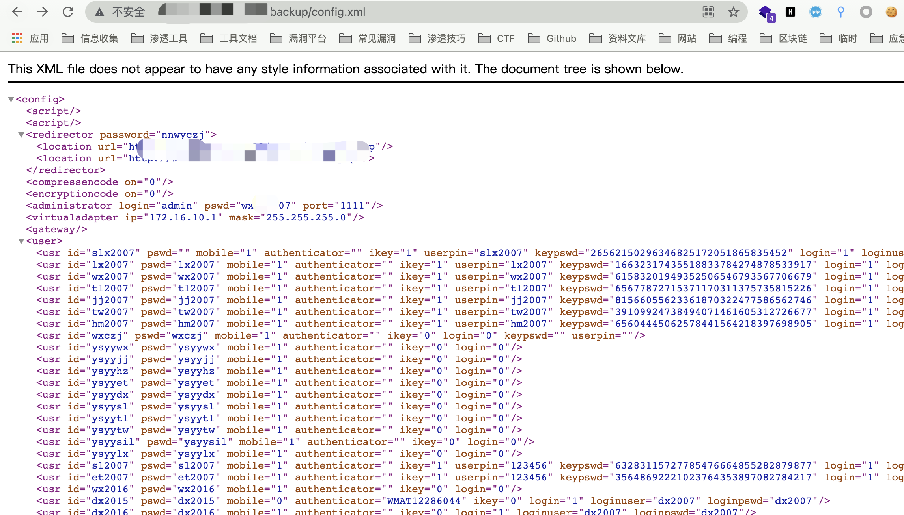

# 惠尔顿 e地通 config.xml 信息泄漏漏洞

## 漏洞描述

惠尔顿 e地通Socks5 VPN登录系统 存在信息泄漏漏洞，访问特殊的Url即可获取管理员账号密码

## 漏洞影响

```
惠尔顿 e地通Socks5 VPN登录系统
```

## 网络测绘

```
app="惠尔顿-e地通VPN"
```

## 漏洞复现

登录页面


访问 **/backup/config.xml，** 泄漏用户信息

