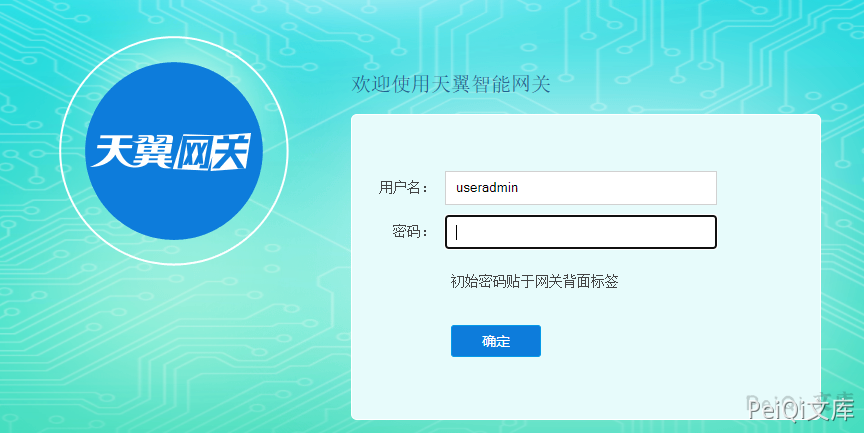
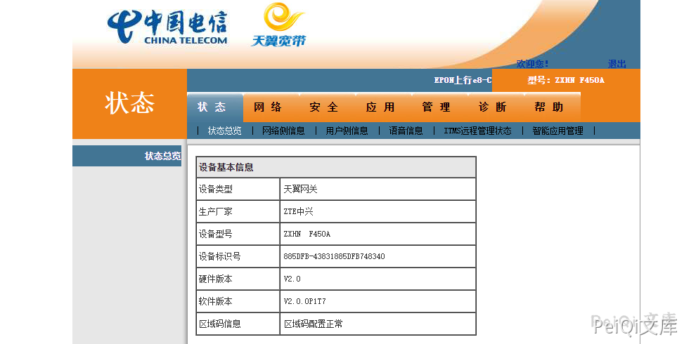

# 电信 中兴ZXHN F450A网关 默认管理员账号密码漏洞

## 漏洞描述

电信中兴ZXHN F450A网关 存在默认管理员账号密码

## 漏洞影响

```
电信中兴ZXHN F450A网关
```

## 网络测绘

```
ZXHN F450A
```

## 漏洞描述

登录页面如下




```plain
user/pass

useradmin/nE7jA%5m 普通管理员
telecomadmin/nE7jA%5m 超级管理员
```

