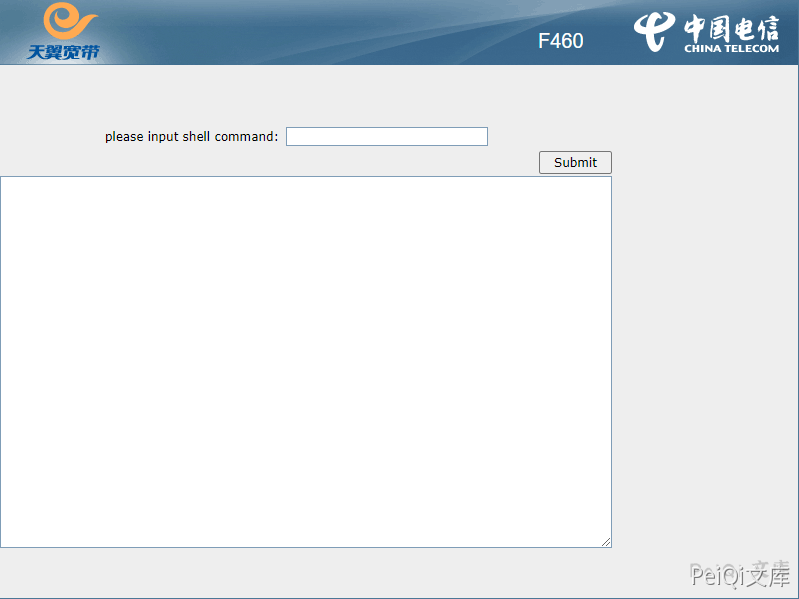
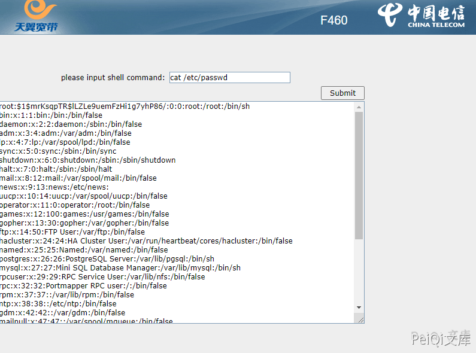

# 电信 天翼网关F460 web_shell_cmd.gch 远程命令执行漏洞

## 漏洞描述

电信天翼网关F460 web_shell_cmd.gch文件存在命令调试界面，攻击者可以利用获取服务器权限

## 漏洞影响

```
电信天翼网关F460
```

## 网络测绘

```
title="F460"
```

## 漏洞复现

出现漏洞的文件为 web_shell_cmd.gch



直接输入命令就可以执行 **cat /etc/passwd**

